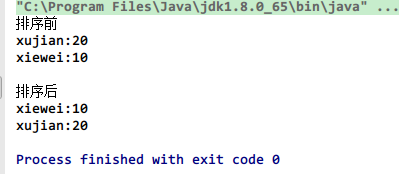
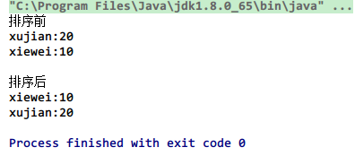

简单来说， Comparable 相当于内比较器，一个类继承了 Comparable 接口，就意味着该类支持排序，至于比较的方法，需要重写接口的 compareTo() 方法来实现。

而 Comparator 可以认为是是一个**外比较器**，个人认为有两种情况可以使用实现 Comparator 接口的方式：

1. 一个对象不支持自己和自己比较（没有实现 Comparable 接口），但是又想对两个对象进行比较。
2. 一个对象实现了 Comparable 接口，但是开发者认为 compareTo 方法中的比较方式并不是自己想要的那种比较方式。

<!-- more -->

## Comparable

Comparable 是排序接口。若一个类实现了 Comparable 接口，就意味着该类支持排序。

实现了 Comparable 接口的类的对象的列表或数组可以通过 Collections.sort 或 Arrays.sort 进行自动排序。

此外，实现此接口的对象可以用作有序映射中的键或有序集合中的集合，无需指定比较器。该接口定义如下：

```java
package java.lang;
import java.util.*;

public interface Comparable<T> {
    public int compareTo(T o);
}
```

T 表示可以与此对象进行比较的那些对象的类型。

此接口只有一个方法 compareTo，比较此对象与指定对象的顺序，如果该对象小于、等于或大于指定对象，则分别返回负整数、零或正整数。

现在我们假设一个 Person 类，代码如下：

```java
public class Person
{
    String name;
    int age;
    public Person(String name, int age)
    {
        super();
        this.name = name;
        this.age = age;
    }
    public String getName()
    {
        return name;
    }
　　public int getAge()
    {
        return age;
    }
}
```

现在有两个 Person 类的对象，我们如何来比较二者的大小呢？我们可以通过让 Person 实现 Comparable 接口：

```java
public class Person implements Comparable<Person>
{
    String name;
    int age;
    public Person(String name, int age)
    {
        super();
        this.name = name;
        this.age = age;
    }
    public String getName()
    {
        return name;
    }
    public int getAge()
    {
        return age;
    }
    @Override
    public int compareTo(Person p)
    {
        return this.age-p.getAge();
    }
    public static void main(String[] args)
    {
        Person[] people=new Person[]{new Person("xujian", 20),new Person("xiewei", 10)};
        System.out.println("排序前");
        for (Person person : people)
        {
            System.out.println(person.getName()+":"+person.getAge());
        }
        Arrays.sort(people);
        System.out.println("\n排序后");
        for (Person person : people)
        {
            System.out.println(person.getName()+":"+person.getAge());
        }
    }
}
```

程序执行结果为：



## Comparator

Comparator 是比较接口，我们如果需要控制某个类的次序，而该类本身不支持排序 (即没有实现 Comparable 接口)，那么我们就可以建立一个“该类的比较器” 来进行排序，这个 “比较器” 只需要实现 Comparator 接口即可。也就是说，我们可以通过实现 Comparator 来新建一个比较器，然后通过这个比较器对类进行排序。该接口定义如下：

```java
package java.util;

public interface Comparator<T>
 {
    int compare(T o1, T o2);
    boolean equals(Object obj);
 }
```

注意：

1. 若一个类要实现 Comparator 接口：它一定要实现 compareTo(T o1, T o2) 函数，但可以不实现 equals(Object obj) 函数。
2. int compare(T o1, T o2) 是 “比较 o1 和 o2 的大小”。返回 “负数”，意味着 “o1 比 o2 小”；返回 “零”，意味着 “o1 等于 o2”；返回 “正数”，意味着 “o1 大于 o2”。

现在假如上面的 Person 类没有实现 Comparable 接口，该如何比较大小呢？我们可以新建一个类，让其实现 Comparator 接口，从而构造一个 “比较器 "。

```java
public class PersonCompartor implements Comparator<Person>
{
    @Override
    public int compare(Person o1, Person o2)
    {
        return o1.getAge()-o2.getAge();
    }
}
```

现在我们就可以利用这个比较器来对其进行排序：

```java
public class Person
{
    String name;
    int age;
    public Person(String name, int age)
    {
        super();
        this.name = name;
        this.age = age;
    }
    public String getName()
    {
        return name;
    }
    public int getAge()
    {
        return age;
    }
    public static void main(String[] args)
    {
        Person[] people=new Person[]{new Person("xujian", 20),new Person("xiewei", 10)};
        System.out.println("排序前");
        for (Person person : people)
        {
            System.out.println(person.getName()+":"+person.getAge());
        }
        Arrays.sort(people,new PersonCompartor());
        System.out.println("\n排序后");
        for (Person person : people)
        {
            System.out.println(person.getName()+":"+person.getAge());
        }
    }
}
```

程序运行结果为：



## Comparable 和 Comparator 区别比较

Comparable 是排序接口，若一个类实现了 Comparable 接口，就意味着 “该类支持排序”。而 Comparator 是比较器，我们若需要控制某个类的次序，可以建立一个“该类的比较器” 来进行排序。

Comparable 相当于 “内部比较器”，而 Comparator 相当于 “外部比较器”。

两种方法各有优劣， 用 Comparable 简单， 只要实现 Comparable 接口的对象直接就成为一个可以比较的对象，但是需要修改源代码。 用 Comparator 的好处是不需要修改源代码， 而是另外实现一个比较器， 当某个自定义的对象需要作比较的时候，把比较器和对象一起传递过去就可以比大小了， 并且在 Comparator 里面用户可以自己实现复杂的可以通用的逻辑，使其可以匹配一些比较简单的对象，那样就可以节省很多重复劳动了。

当然，这不是鼓励用 Comparator，意思是开发者还是要在具体场景下选择最合适的那种比较器而已。