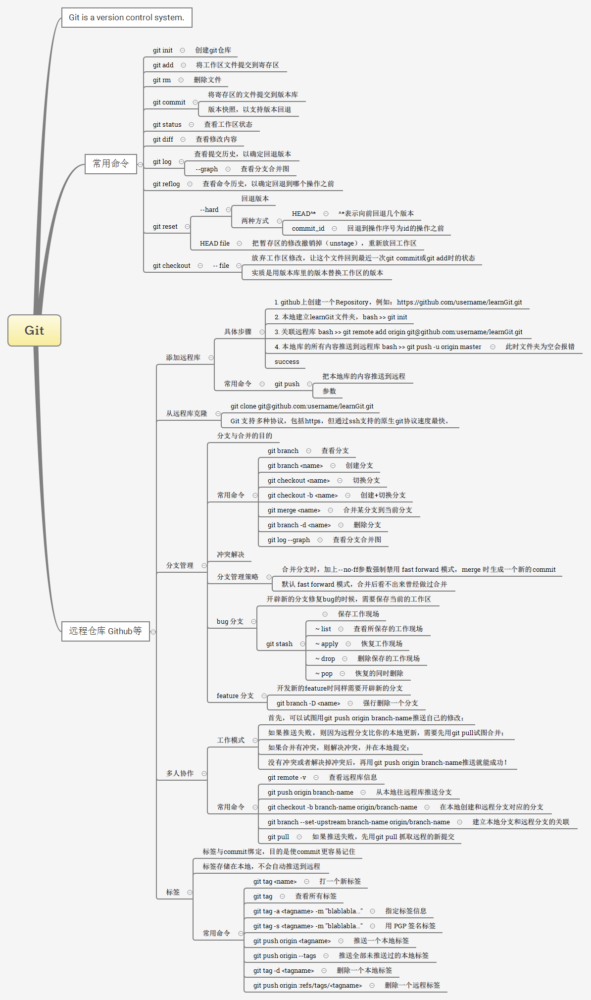

> 这几天折腾 hexo 的时候，解决了一件拖了很久的事情，就是把 git 基础系统地学了一遍。

所依据的教程是廖雪峰老师的博客：[Git 教程](http://www.liaoxuefeng.com/wiki/0013739516305929606dd18361248578c67b8067c8c017b000/)，写的确实浅显易懂。git 本身的使用很简单，但还是需要多使用，方能熟练。

为了防止遗忘以及方便查询，我根据廖雪峰老师的博客，做了一张思维导图，以备留用。

> 也许会有一些不严谨的地方，后面用的过程中也会适当修改。

