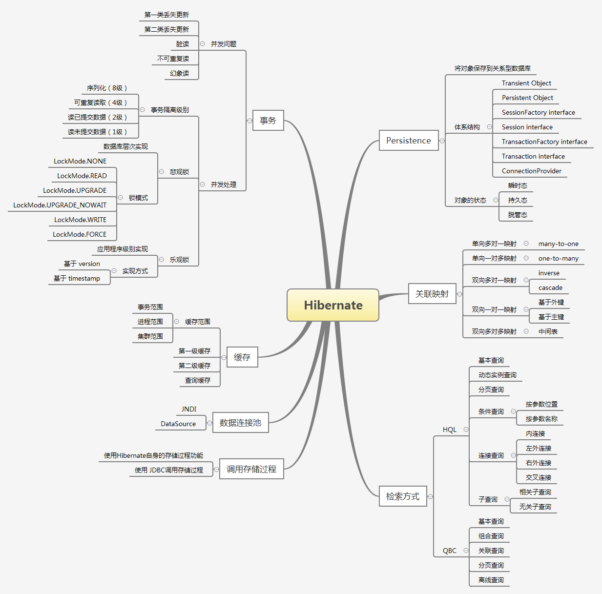

本文用以总结一下Hibernate基础知识。



## 一、what?

何为Hibernate？

Hibernate框架也许是是当今最流行的ORM(Object Relational Mapping 对象-关系型数据映射)工具。用来做什么呢？不知道你有没有只用servlet写网站的经历，各种CRUD操作，getString\getInt语句对每个字段进行处理，写得手断。

何为持久化？持久化是指把数据保存到可持久保存的存储设备中，这里指将内存中的数据存储在关系型数据库中。所以数据访问层也称持久化层。

Hibernate 作为数据访问层，通过配置文件和映射文件将持久化对象映射到数据库表中，然后通过操作持久化对象，对数据库进行各种操作。这就使得我们操作数据库就像写sql语句一样方便，不过还没到ibatis那样简单的程度。

介绍完毕，接下来文章的主要部分只写一些我认为比较重要的部分，不重要的内容都在文章前面的思维导图中罗列了出来。

<!-- more -->

## 二、Hibernate初步

### 执行流程

- 创建Configuration实例
- 创建SessionFactory
- 打开Session
- 开始一个Transaction （事务中包含所执行的CRUD操作）
- 提交Transaction
- 关闭Session

### IDE支持

MyEclipse和Intellij IDEA都提供对Hibernate的支持，可以根据数据库自动生成实体类和映射文件，但需要根据数据库中的映射关系加以适当修改。

## 三、关联映射

以图书以出版社为例，books 数据表项publisherId为外键，指向publishers表Id项。

### 单向多对一

图书与出版社的单向多对一映射配置如下：

实体类配置如下：

```java
//private Integer publisherId;
private Integer publisher;
省略构造方法，set/get方法
```

映射文件中配置如下：

```xml
<many-to-one name="publishers" column="publisherId"
             class=*.*.pojo.publishers"/>
```

### 单向一对多

图书与出版社的单向一对多映射配置如下：

实体类配置如下：

```java
private Set bks = new HashSet();
省略构造方法，set/get方法
```

映射文件中配置如下：

```xml
<set name="bks" lazy="false">
            <key>
                <column name="publisherId" />
            </key>
            <one-to-many class="*.*.pojo.books" />
        </set>
```

### 双向多对一

#### 添加数据

但单向映射会比较麻烦，因为如果要操作数据库时，需要在多个地方进行操作。

例如，此时我们需要添加西安电子科技大学出版社到publishers表中，并在该出版社下添加两本图书信息。

按上面的单向映射，我们需要先加载西安电子科技大学出版社对象，然后创建图书对象，再将西安电子科技大学出版社对象设置关联到图书对象的publisher属性中，最后将图书对象持久化。

太麻烦了！

这时候就需要配置双向映射，可以同时完成出版社和相应图书信息的添加。

配置双向映射，可以有两种方法，即分别选取“一”方或“多”方管理关联关系。

set元素有两个比较重要的属性：

- inverse 反转
  - false 表示由自己（“一”方）管理双方关联关系
  - true 表示由对方（“多”方）管理
- cascade 级联，当主控方执行操作时，被动方是否同步执行同一操作
  - all 任何情况下都进行级联操作
  - none 任何情况下都不
  - save-update 在执行save或update时执行
  - dalete 执行delete时执行

通常来说，将“多”方设置为主控方，效率会比较高。

#### 删除数据

同样存在从两个方向删除数据的情况。

- 从“多”方删除：删除books中的项，并不会影响publishers中数据。
- 从“一方”删除：因为“多”方的外键指向，所以删除publishers表中记录时，同时会将books中关联的数据同时删除。

#### 更改数据

类似

### 双向一对一映射

#### 基于外键

基于外键的一对一映射，与多对一关联实质相同，是多对一的一个实例。

<many-to-one>中增加 unique="true"属性，并用name属性指定关联属性的属性名。

另一端使用<one-to-one>元素，同样使用name属性来指定关联属性的属性名。

#### 基于主键

基于主键的一对一映射，即限制两个数据表的主键使用相同的值，通过主键形成一对一的映射关系。

使用 foreign 策略生成主键，任何一方使用 foreign 策略，表明根据对方主键生成自己的主键。双方均使用<one-to-one>元素映射关联属性。

### 多对多关联映射

多对多的映射关系比较复杂，程序设计中一般不建议直接在两表之间建立多对多关联，否则会造成两者之间的过分依赖。

可以采用通过一个中间表来维护两者之间的多对多关联，中间表分别与两表构成多对一关联。

例如：students 与 courses，一个学生可以选多门课，一门课也可以由多个学生选。

建立一个中间表sc，如下：

| 字段   | 说明              |
| ---- | --------------- |
| sid  | 外键，指向 studentId |
| cid  | 外键，指向 courseId  |

students 映射文件配置：

```xml
<set name="courses" table="sc" lazy="false" inverse="false" cascade="save-update">
	<key column="sid" not-null="true" />
  <many-to-many column="cid" class="*.*.pojo.course"/>
</set>
```

courses 映射文件配置：

```xml
<set name="students" table="sc" lazy="false" inverse="false" cascade="save-update">
	<key column="cid" not-null="true" />
  <many-to-many column="cid" class="*.*.pojo.student"/>
</set>
```

## 四、检索方式

### HQL查询

直接针对实体类和属性进行查询，不用编写繁琐的SQL语句；查询结果是直接保存在List中的对象，不用再次封装。

1. 获得 session
2. 编写 HQL 语句
3. 创建 Query 对象
4. 执行查询，获得结果

### QBC查询

采用面向对象的方式封装查询条件，Criteria API 提供了 Criteria 和 Criterion 接口以及 Example 和 Restrictions 类作为辅助。

1. 获得 session
2. 创建 Criteria 对象
3. 使用 Restrictions 对象编写查询条件，并将查询条件加入 Criteria 对象
4. 执行查询，获得结果

## 五、批量处理

因为 Hibernate 是对 JDBC的轻量级封装

### 批量插入

- 通过 Hibernate 缓存
- 绕过 Hibernate，直接调用 JDBC API

### 批量更新

- 通过 Hibernate 直接进行批量更新
- 绕过 Hibernate，直接调用 JDBC API

### 批量删除

- 通过 Hibernate 直接进行批量删除
- 绕过 Hibernate，直接调用 JDBC API

## 六、Hibernate事务

### 何为事务？

事务具有原子性，要么全部执行，要么全部不执行，不存在事务执行一半的情况，执行失败会采取回滚操作。

一致性，事务在完成时，必须保证所有的数据保持一致状态。

隔离性，并发事务所作的修改必须与任何其他事物所作的修改相隔离，查看数据时，事务要么处在被另一并发事务修改之前的状态，要么处在被修改之后的状态。即事务不会查看由另一并发事务正在修改的数据，这种隔离性也叫可串行性。

持久性，事务完成后，其对系统的影响是永久的。

### 并发问题

多个事物同时使用相同数据可能发生以下问题：

- 第一类丢失更新

  当多个事务同时操作同一个数据，撤销其中一个事物时，把其他事物已经提交的更新数据覆盖了，对其它事务来说造成了数据丢失。

- 第二类丢失更新

  事务A将修改结果提交成功后，覆盖了事务B提交的修改结果，对事务B来说造成了数据丢失。

- 脏读

  事务A读到了事务B未提交的更新数据，且对数据进行操作，如果事务B撤销更新后，事务A所操作的数据变成了脏数据。

- 不可重复读

  事务A对同一组数据重复读取两次的结果不同，可能期间原始数据被其他事物修改了。

- 幻象读

  事务A执行两次查询，第二次查询结果比第一次查询多出一行，因为两次查询之间事务B插入了新数据。

### 并发处理

为了避免上述问题，标准SQL规范中提出了4个事务隔离级别。

- 序列化（8级）

  最严格的事务隔离。该级别不允许事务并发执行，只允许串行执行。

  此级别可有效防止脏读、不可重复读和幻象读。

- 可重复读取（4级）

  一个事务在执行过程中可以访问其他事务成功提交的新插入的数据，但不能访问成功修改的数据。

  读取数据的事务将会禁止写事务，但允许读事务。写事务则禁止其他事务。

  此级别可有效防止不可重复读和脏读。

- 读已提交数据（2级）

  一个事务在执行过程中可以访问其他事务成功提交的新插入的数据，也可以访问成功修改的数据。

  读取数据的事务允许其他事务继续访问该行数据，但未提交的写事务将会禁止其他事务访问该数据。

  此级别可有效防止脏读。

- 读未提交数据（1级）

  一个事务在执行过程中可以访问其他事务未提交的新插入的数据，也可以访问未提交的修改数据。

  写事务不允许其他写事务同时操作，但允许读事务。

  此级别仅可防止第一类丢失更新。

隔离级别越高，虽然数据完整性和一致性越好，但并发性能越糟。

**一般将数据库的隔离级别设为2级。**该级别存在的问题可以在程序中采用悲观锁或乐观锁加以控制。

### 悲观锁和乐观锁

#### 悲观锁

悲观锁，是指每次操作数据时，总是悲观地认为会有其他事务来操作同一数据，因此在整个数据处理的过程中，将数据处于锁定状态。

悲观锁由数据库来实现，锁定期间其他事务不对数据进行操作。

Hibernate 中，用户显式地设定要锁定的表或字段及锁模式。

锁模式如下：

- LockMode.NONE 默认
- LockMode.READ
- LockMode.UPGRADE
- LockMode.UPGRADE_NOWAIT
- LockMode.WRITE
- LockMode.FORCE

#### 乐观锁

相比于悲观锁，乐观锁就积极的多了。乐观锁通常认为多个事物同时操作同一数据的情况很少发生，因此乐观锁不做数据库层次上的锁定，而是基于数据版本标识来实现应用程序级别的锁定机制。

数据版本标识，就是为数据表增加一个 version 字段，更新数据时将版本标识加1。提交数据的版本号如果大于数据表中的版本号，则接受更新，否则禁止更新。

Hibernate 中为乐观锁提供了两种基于版本控制的实现。

- 基于 version 
- 基于 timestamp

## 七、Hibernate 缓存

### 缓存的范围

- 事务范围
- 进程范围
- 集群范围

### 第一级缓存

由 session 提供，只存在于 session 生命周期中。

当应用程序调用 Session 接口的 save()、update()、saveOrUpdate()、get()、load()或者Query和Criteria实例的list()、iterate()等方法时，如果 session 缓存中没有相应对象，Hibernate 就会把对象加入到第一级缓存中。

当 session 关闭时，该 session 所管理的一级缓存也会被立即清除。

### 第二级缓存

二级缓存是一个可插拔的缓存插件，由 SessionFactory 负责管理。

由于 SessionFactory 对象的生命周期与应用程序的整个过程对应，因此，二级缓存是在进程或者集群范围的缓存。

### 查询缓存

查询缓存将查询结果存储在第二级缓存中。

查询缓存的生命周期，如果当前关联的表发生修改，那么查询缓存生命周期结束。

