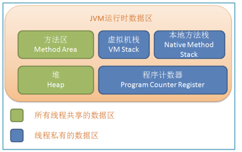

本文主要写一写 JVM 基础知识，对《深入理解 JVM》一书的梳理。

<!-- more -->

## JVM 内存区域

根据《Java 虚拟机规范》的规定，JVM 所管理的内存区域包括以下几个运行时数据区域：

### 程序计数器

一块比较小的内存空间，可以看做是当前线程所执行的字节码的行号指示器。JVM 概念模型中，字节码解释器工作时通过改变计数器的值来获取下一条需要执行的字节码指令，分支、循环、跳转、异常处理、线程恢复等基础功能都需要依赖计数器来完成。

- 线程私有。每个线程都拥有独立的程序计数器。
- 不会 OOM，不需要 GC。

### 虚拟机栈

- 线程私有，生命周期与线程相同。
- 每个方法执行时都会创建一个栈帧（Stack Frame），用于存储局部变量表、操作数栈、动态链接、方法出口信息。
- 方法从调用到执行完成，对应栈帧在虚拟机栈中的入栈到出栈的过程。
- StackOverflowError or OutOfMemoryError

### 本地方法栈

- 本地方法栈与虚拟机栈作用十分相似，不同点在于，虚拟机栈为 JVM 执行 Java 方法（即字节码）服务，而本地方法栈为 JVM 使用到的 Native 方法服务。 
- StackOverflowError or OutOfMemoryError

### 堆

- 线程共享。
- 存放对象实例。所有对象实例及数组都要在堆上分配。
- GC 堆。垃圾收集器管理的主要区域。
- 可分为新生代和老年代，再细致一点就是Eden、From Survivor、To Survivor等。
- OOM

### 方法区

- 线程共享。
- 存储已被 JVM 加载的类信息、常量、静态变量、即时编译器编译后的代码等数据。
- OOM

## 内存模型

这部分见我的另一篇博文 [Java内存模型](http://blog.yunz.space/2017/03/26/Java%E5%86%85%E5%AD%98%E6%A8%A1%E5%9E%8B/#more)，个人觉得写的还行。

## 垃圾收集器

见文章开头思维导图部分

## JVM 优化

