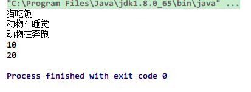
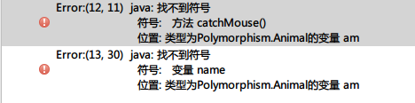
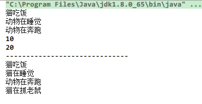

> 博客建了好些天了，不知道写些啥，最近 Java 学得有些头大，转载点东西吧==

本段来源于知乎的一个回答，思路比较清晰，例子也比较好，记录一下。原文链接 >>> https://www.zhihu.com/question/30082151/answer/120520568

## 何为多态？

用一句话概括就是：**事物在运行过程中存在不同的状态。**

多态的存在有**三个前提**:

- **要有继承关系**
- **子类要重写父类的方法**
- **父类引用指向子类对象**

但是其中又有很多细节需要注意。首先我们定义两个类，一个父类 Animal，一个子类 Cat。
**父类 Animal**

```java
class Animal {
	int num = 10;
	static int age = 20;
	public void eat() {
		System.out.println("动物吃饭");
	}
	public static void sleep() {
		System.out.println("动物在睡觉");
	}
	public void run(){
		System.out.println("动物在奔跑");
	}
}
```

**子类 Cat**

```java
class Cat extends Animal {
	int num = 80;
	static int age = 90;
    String name = "tomCat";
	public void eat() {
		System.out.println("猫吃饭");
	}

	public static void sleep() {
		System.out.println("猫在睡觉");
	}

	public void catchMouse() {
		System.out.println("猫在抓老鼠");
	}
}
```

**测试类 Demo_Test1**

```java
class Demo_Test1 {
	public static void main(String[] args) {	
		Animal am = new Cat();
		am.eat();
		am.sleep();
		am.run();
      	//am.catchMouse();这里先注释掉，等会会说明
      	//System.out.println(am.name);//这里先注释，待会说明
      	System.out.println(am.num);
      	System.out.println(am.age);
	}
}
```

以上的三段代码充分体现了多态的三个前提，即：
**1、存在继承关系**
Cat 类继承了 Animal 类
**2、子类要重写父类的方法**
子类重写 (override) 了父类的两个成员方法 eat()，sleep()。其中 eat() 是非静态的，sleep() 是静态的（static）。
**3、父类数据类型的引用指向子类对象。**
测试类 Demo_Test1 中**Animal am = new Cat();** 语句在堆内存中开辟了子类 (Cat) 的对象，并把栈内存中的父类 (Animal) 的引用指向了这个 Cat 对象。
到此，满足了 Java 多态的的必要三个前提。

如果再深究一点呢，我们可以看看上面测试类的输出结果，或许对多态会有更深层次的认识。猜一猜上面的结果是什么。
 

可以看出来：

- 子类 Cat 重写了父类 Animal 的非静态成员方法 am.eat(); 的输出结果为：猫吃饭。
- 子类重写了父类 (Animal) 的静态成员方法 am.sleep(); 的输出结果为：动物在睡觉
- 未被子类（Cat）重写的父类（Animal）方法 am.run() 输出结果为：动物在奔跑
- System.out.println(am.num);   //输出结果为10
- System.out.println(am.age);    //输出结果为20

那么我们可以根据以上情况总结出多态成员访问的特点：

- **成员变量**

  编译看左边 (父类)，运行看左边 (父类)。

- **成员方法**

  编译看左边 (父类)，运行看右边 (子类)。动态绑定

- **静态方法**

  编译看左边 (父类)，运行看左边 (父类)。
  (静态和类相关，算不上重写，所以，访问还是左边的)

- **只有非静态的成员方法, 编译看左边, 运行看右边 **

--------------------------------------------------- 华丽的分割线 ----------------------------------------------------------------------
那么多态有什么弊端呢？有的，即多态后不能使用子类特有的属性和方法。往上面的代码看，子类 Cat 有一个特有的属性 String name = "tomCat"; 并且还有一个特有的抓老鼠的方法 catchMouse()。但是在测试类（Demo_Test）中，我们尝试调用子类特有的方法 catchMouse() 和打印子类特有的成员属性 String name = "tomCat"; 就会报错。


**原因就是多态的弊端，就是：不能使用子类特有的成员属性和子类特有的成员方法。**

## 强制类型转换

如果在代码执行过程中还想使用 Cat 类中特有的属性 String name 和它特有的成员方法 catchMouse() 了怎么办呢？

那我们就可以把这个父类引用指向了子类对象的家伙 am 再强制变回 Cat 类型。这样 am 就是 Cat 类型的引用了，指向的也是 Cat 对象了，自然也能使用 Cat 类的一切属性和一切的成员方法。

```java
public class TestDemo01 {
    public static void main(String[] args) {

        Animal am = new Cat();
        am.eat();
        am.sleep();
        am.run();
//	am.catchMouse();
//	System.out.println(am.name);
        System.out.println(am.num);
        System.out.println(am.age);

        System.out.println("------------------------------");
        Cat ct = (Cat)am;
        ct.eat();
        ct.sleep();
        ct.run();
        ct.catchMouse();
    }
}
```

结果：



很明显，执行强转语句 `Cat ct = (Cat)am;` 之后，ct 就指向最开始在堆内存中创建的那个 Cat 类型的对象了。这就是多态的魅力吧，虽然它有缺点，但是它确实十分灵活，减少多余对象的创建，不用说为了使用子类的某个方法又去重新再堆内存中开辟一个新的子类对象。

以上。