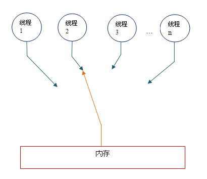
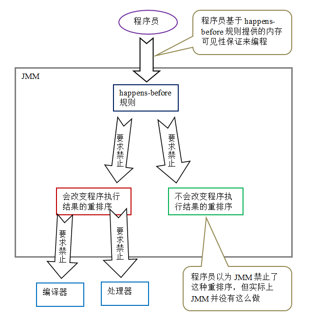
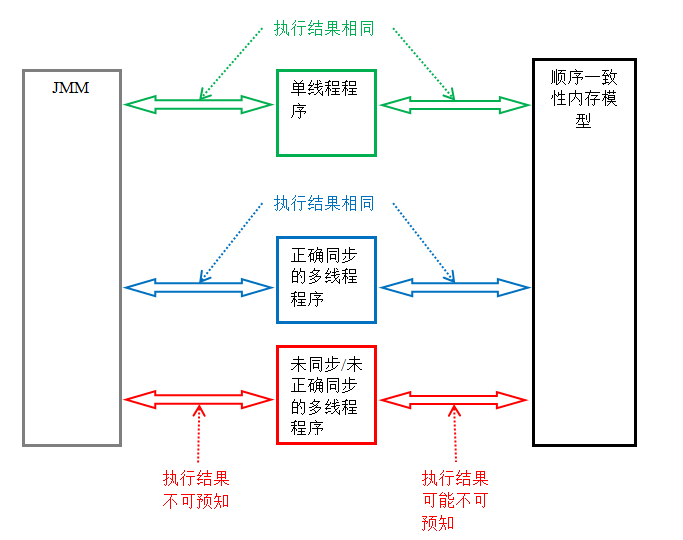

> 一直想写这篇文章，想通过这篇文章深刻地认识一下 Java 的内存模型。可是每次写到一半就放弃了。基础功力太弱，感觉虚得很。今天这篇文章，放弃了自己完整阐述的想法，通过资料整合的方式来进行。

同样的，本文依然先通过思维导图来理清思路，然后再逐一阐述。

<!-- more -->

Java 内存模型（JMM，Java Memory Model），JMM 定义了 Java 虚拟机在计算机内存（RAM）中的工作方式。JVM 是整个计算机虚拟模型，所以 JMM 是隶属于 JVM 的。

理解 JMM，是学习并发编程的基础。JMM 定义了多线程之间共享变量的可见性以及如何在需要的时候对共享变量进行同步。

## 关于并发编程

并发编程有两个关键问题：如何进行线程间的通信和同步？

### 线程间通信机制

- 共享内存：线程之间共享程序的公共状态，线程之间通过写 - 读内存中的公共状态来隐式进行通信。
- 消息传递：线程之间没有公共状态，线程之间必须通过明确的发送消息来显式进行通信。

### 同步

同步是指程序用于控制不同线程之间操作发生相对顺序的机制。

在共享内存并发模型里，同步是显式进行的。程序员必须显式指定某个方法或某段代码需要在线程之间互斥执行。

在消息传递的并发模型里，由于消息的发送必须在消息的接收之前，因此同步是隐式进行的。


讲 Java 内存模型之前，我们首先需要理解几个相关的概念。

## 现代计算机内存架构

首先我们需要了解现代计算机的内存架构，如下图：


现代计算机一般都有 2 个以上 CPU，而且每个 CPU 还有可能包含多个核心。因此，如果我们的应用是多线程的话，这些线程可能会在各个 CPU 核心中并行运行。

在 CPU 内部有一组 CPU 寄存器，也就是 CPU 的储存器。CPU 操作寄存器的速度要比操作计算机主存快的多。在主存和 CPU 寄存器之间还存在一个 CPU 缓存，CPU 操作 CPU 缓存的速度快于主存但慢于 CPU 寄存器。某些 CPU 可能有多个缓存层（一级缓存和二级缓存）。计算机的主存也称作 RAM，所有的 CPU 都能够访问主存，而且主存比上面提到的缓存和寄存器大很多。

当一个 CPU 需要访问主存时，会先读取一部分主存数据到 CPU 缓存，进而在读取 CPU 缓存到寄存器。当 CPU 需要写数据到主存时，同样会先 flush 寄存器到 CPU 缓存，然后再在某些节点把缓存数据 flush 到主存。

现代的处理器使用写缓冲区来临时保存向内存写入的数据。写缓冲区可以保证指令流水线持续运行，它可以避免由于处理器停顿下来等待向内存写入数据而产生的延迟。

同时，通过以批处理的方式刷新写缓冲区，以及合并写缓冲区中对同一内存地址的多次写，可以减少对内存总线的占用。虽然写缓冲区有这么多好处，但每个处理器上的写缓冲区，仅仅对它所在的处理器可见。这个特性会对内存操作的执行顺序产生重要的影响：处理器对内存的读 / 写操作的执行顺序，不一定与内存实际发生的读 / 写操作顺序一致！

由于写缓冲区仅对自己的处理器可见，它会导致处理器执行内存操作的顺序可能会与内存实际的操作执行顺序不一致。由于现代的处理器都会使用写缓冲区，因此现代的处理器都会允许对写 - 读操做重排序。


## 指令重排序

在执行程序时，为了提高性能，编译器和处理器会对指令做重排序。分为三种：

1. 编译器优化的重排序。编译器在不改变单线程程序语义的前提下，可以重新安排语句的执行顺序。
2. 指令级并行的重排序。现代处理器采用了指令级并行技术（Instruction-Level Parallelism， ILP）来将多条指令重叠执行。如果不存在数据依赖性，处理器可以改变语句对应机器指令的执行顺序。
3. 内存系统的重排序。由于处理器使用缓存和读 / 写缓冲区，这使得加载和存储操作看上去可能是在乱序执行。

从 java 源代码到最终实际执行的指令序列，会分别经历下面三种重排序：


上述的 1 属于编译器重排序，2 和 3 属于处理器重排序。这些重排序都可能会导致多线程程序出现内存可见性问题。对于编译器，JMM 的编译器重排序规则会禁止特定类型的编译器重排序（不是所有的编译器重排序都要禁止）。

那么如何禁止特定类型的处理器重排序呢？为了保证内存可见性，java 编译器在生成指令序列的适当位置会插入内存屏障指令来禁止特定类型的处理器重排序。


## 内存屏障

> 内存屏障，又称内存栅栏，是一个 CPU 指令，基本上它是一条这样的指令：
> 1、保证特定操作的执行顺序。
> 2、影响某些数据（或则是某条指令的执行结果）的内存可见性。

编译器和 CPU 能够重排序指令，保证最终相同的结果，尝试优化性能。插入一条 Memory Barrier 会告诉编译器和 CPU：不管什么指令都不能和这条 Memory Barrier 指令重排序。

Memory Barrier 所做的另外一件事是强制刷出各种 CPU cache，如一个 Write-Barrier（写入屏障）将刷出所有在 Barrier 之前写入 cache 的数据，因此，任何 CPU 上的线程都能读取到这些数据的最新版本。

下面是常见处理器允许的重排序类型的列表：

|           | Load-Load | Load-Store | Store-Store | Store-Load | 数据依赖 |
| --------- | :-------: | :--------: | :---------: | :--------: | :--: |
| sparc-TSO |     N     |     N      |      N      |     Y      |  N   |
| x86       |     N     |     N      |      N      |     Y      |  N   |
| ia64      |     Y     |     Y      |      Y      |     Y      |  N   |
| PowerPC   |     Y     |     Y      |      Y      |     Y      |  N   |

上面表格中的各种处理器内存模型，从上到下，模型由强变弱。越是追求性能的处理器，内存模型设计的会越弱。因为这些处理器希望内存模型对它们的束缚越少越好，这样它们就可以做尽可能多的优化来提高性能。

对应的，JMM 把内存屏障指令分为下列四类：

| 屏障类型                | 指令示例                       | 说明                                       |
| ------------------- | -------------------------- | ---------------------------------------- |
| LoadLoad Barriers   | Load1; LoadLoad; Load2     | 确保 Load1 数据的装载，之前于 Load2 及所有后续装载指令的装载。   |
| StoreStore Barriers | Store1; StoreStore; Store2 | 确保 Store1 数据对其他处理器可见（刷新到内存），之前于 Store2 及所有后续存储指令的存储。 |
| LoadStore Barriers  | Load1; LoadStore; Store2   | 确保 Load1 数据装载，之前于 Store2 及所有后续的存储指令刷新到内存。 |
| StoreLoad Barriers  | Store1; StoreLoad; Load2   | 确保 Store1 数据对其他处理器变得可见（指刷新到内存），之前于 Load2 及所有后续装载指令的装载。StoreLoad Barriers 会使该屏障之前的所有内存访问指令（存储和装载指令）完成之后，才执行该屏障之后的内存访问指令。 |

这和 java 有什么关系？volatile 是基于 Memory Barrier 实现的。

如果一个变量是 volatile 修饰的，JMM 会在写入这个字段之后插进一个 Write-Barrier 指令，并在读这个字段之前插入一个 Read-Barrier 指令。

这意味着，如果写入一个 volatile 变量 a，可以保证：

1. 一个线程写入变量 a 后，任何线程访问该变量都会拿到最新值。
2. 在写入变量 a 之前的写入操作，其更新的数据对于其他线程也是可见的。因为 Memory Barrier 会刷出 cache 中的所有先前的写入。


## `as-if-serial` 语义

### 数据依赖性

如果两个操作访问同一个变量，且这两个操作中有一个为写操作，此时这两个操作之间就存在数据依赖性。数据依赖分下列三种类型：

- 写后读
- 写后写
- 读后写

上面三种情况，只要重排序两个操作的执行顺序，程序的执行结果将会被改变。

### `as-if-serial` 语义

不管怎么重排序（编译器和处理器为了提高并行度），（单线程）程序的执行结果不能被改变。编译器，runtime 和处理器都必须遵守 `as-if-serial` 语义。

为了遵守 as-if-serial 语义，编译器和处理器不会对存在数据依赖关系的操作做重排序，因为这种重排序会改变执行结果。但是，如果操作之间不存在数据依赖关系，这些操作可能被编译器和处理器重排序。

但是请注意：这里所说的数据依赖性仅针对单个处理器中执行的指令序列和单个线程中执行的操作，不同处理器之间和不同线程之间的数据依赖性不被编译器和处理器考虑。


## 顺序一致性

### 数据竞争

当程序未正确同步时，就会存在数据竞争。java 内存模型规范对数据竞争的定义如下：

- 在一个线程中写一个变量，
- 在另一个线程读同一个变量，
- 而且写和读没有通过同步来排序。

当代码中包含数据竞争时，程序的执行往往产生违反直觉的结果。如果一个多线程程序能正确同步，这个程序将是一个没有数据竞争的程序。

### 顺序一致性内存模型

顺序一致性内存模型是一个被计算机科学家理想化了的理论参考模型，它为程序员提供了极强的内存可见性保证。顺序一致性内存模型有两大特性：

- 一个线程中的所有操作必须按照程序的顺序来执行。
- （不管程序是否同步）所有线程都只能看到一个单一的操作执行顺序。在顺序一致性内存模型中，每个操作都必须原子执行且立刻对所有线程可见。

顺序一致性内存模型为程序员提供的视图如下：



在概念上，顺序一致性模型有一个单一的全局内存，这个内存通过一个左右摆动的开关可以连接到任意一个线程。同时，每一个线程必须按程序的顺序来执行内存读 / 写操作。从上图我们可以看出，在任意时间点最多只能有一个线程可以连接到内存。当多个线程并发执行时，图中的开关装置能把所有线程的所有内存读 / 写操作串行化。

顺序一致性内存模型是一个理论参考模型，JMM 和处理器内存模型在设计时通常会把顺序一致性内存模型作为参照。JMM 和处理器内存模型在设计时会对顺序一致性模型做一些放松，因为如果完全按照顺序一致性模型来实现处理器和 JMM，那么很多的处理器和编译器优化都要被禁止，这对执行性能将会有很大的影响。

根据对不同类型读 / 写操作组合的执行顺序的放松，可以把常见处理器的内存模型划分为下面几种类型：

1. 放松程序中写 - 读操作的顺序，由此产生了 total store ordering 内存模型（简称为 TSO）。
2. 在前面 1 的基础上，继续放松程序中写 - 写操作的顺序，由此产生了 partial store order 内存模型（简称为 PSO）。
3. 在前面 1 和 2 的基础上，继续放松程序中读 - 写和读 - 读操作的顺序，由此产生了 relaxed memory order 内存模型（简称为 RMO）和 PowerPC 内存模型。

注意，这里处理器对读 / 写操作的放松，是以两个操作之间不存在数据依赖性为前提的（因为处理器要遵守 as-if-serial 语义，处理器不会对存在数据依赖性的两个内存操作做重排序）。

为了在不同的处理器平台向程序员展示一个一致的内存模型，JMM 在不同的处理器中需要插入的内存屏障的数量和种类也不相同。

下图展示了 JMM 在不同处理器内存模型中需要插入的内存屏障的示意图：


如上图所示，JMM 屏蔽了不同处理器内存模型的差异，它在不同的处理器平台之上为 java 程序员呈现了一个一致的内存模型。

好了，到这里终于谈到 Java 内存模型了。

从 JMM 设计者的角度来说，在设计 JMM 时，需要考虑两个关键因素：

- 程序员对内存模型的使用。程序员希望内存模型易于理解，易于编程。程序员希望基于一个强内存模型来编写代码。
- 编译器和处理器对内存模型的实现。编译器和处理器希望内存模型对它们的束缚越少越好，这样它们就可以做尽可能多的优化来提高性能。编译器和处理器希望实现一个弱内存模型。

由于这两个因素互相矛盾，所以 JSR-133 专家组在设计 JMM 时的核心目标就是找到一个好的平衡点：一方面要为程序员提供足够强的内存可见性保证；另一方面，对编译器和处理器的限制要尽可能的放松。


## Java内存抽象模型

Java 线程之间的通信由 Java 内存模型（本文简称为 JMM）控制，JMM 决定一个线程对共享变量的写入何时对另一个线程可见。

从抽象的角度来看，JMM 定义了线程和主内存之间的抽象关系：线程之间的共享变量存储在主内存（main memory）中，每个线程都有一个私有的本地内存（local memory），本地内存中存储了该线程以读 / 写共享变量的副本。本地内存是 JMM 的一个抽象概念，并不真实存在。它涵盖了缓存，写缓冲区，寄存器以及其他的硬件和编译器优化。

Java 内存模型的抽象示意图如下：


Java多线程利用共享内存实现通信，过程如图所示：


如上图所示，本地内存 A 和 B 有主内存中共享变量 x 的副本。假设初始时，这三个内存中的 x 值都为 0。线程 A 在执行时，把更新后的 x 值（假设值为 1）临时存放在自己的本地内存 A 中。当线程 A 和线程 B 需要通信时，线程 A 首先会把自己本地内存中修改后的 x 值刷新到主内存中，此时主内存中的 x 值变为了 1。随后，线程 B 到主内存中去读取线程 A 更新后的 x 值，此时线程 B 的本地内存的 x 值也变为了 1。

从整体来看，这两个步骤实质上是线程 A 在向线程 B 发送消息，而且这个通信过程必须要经过主内存。JMM 通过控制主内存与每个线程的本地内存之间的交互，来为 java 程序员提供内存可见性保证。


## `happens-before` 规则

从 jdk5 开始，java 使用新的 `JSR-133` 内存模型，基于 `happens-before` 的概念来阐述操作之间的内存可见性。

在 JMM 中，如果一个操作的执行结果需要对另一个操作可见，那么这两个操作之间必须要存在 `happens-before` 关系，这个的两个操作既可以在同一个线程，也可以在不同的两个线程中。

与程序员密切相关的 happens-before 规则如下：

1. 程序顺序规则：一个线程中的每个操作，happens-before 于该线程中任意的后续操作。
2. 监视器锁规则：对一个锁的解锁操作，happens-before 于随后对这个锁的加锁操作。
3. volatile 域规则：对一个 volatile 域的写操作，happens-before 于任意线程后续对这个 volatile 域的读。
4. 传递性规则：如果 A happens-before B，且 B happens-before C，那么 A happens-before C。

注意：两个操作之间具有 happens-before 关系，并不意味前一个操作必须要在后一个操作之前执行！仅仅要求前一个操作的执行结果，对于后一个操作是可见的，且前一个操作按顺序排在后一个操作之前。


为了具体说明，请看前面提到过的计算圆面积的示例代码：

```
double pi  = 3.14;    //A
double r   = 1.0;     //B
double area = pi * r * r; //C

```

上面计算圆的面积的示例代码存在三个 happens- before 关系：

1. A happens- before B；
2. B happens- before C；
3. A happens- before C；

由于 A happens- before B，happens- before 的定义会要求：A 操作执行的结果要对 B 可见，且 A 操作的执行顺序排在 B 操作之前。 但是从程序语义的角度来说，对 A 和 B 做重排序即不会改变程序的执行结果，也还能提高程序的执行性能（允许这种重排序减少了对编译器和处理器优化的束缚）。也就是说，上面这 3 个 happens- before 关系中，虽然 2 和 3 是必需要的，但 1 是不必要的。因此，JMM 把 happens- before 要求禁止的重排序分为了下面两类：

- 会改变程序执行结果的重排序。
- 不会改变程序执行结果的重排序。

JMM 对这两种不同性质的重排序，采取了不同的策略：

- 对于会改变程序执行结果的重排序，JMM 要求编译器和处理器必须禁止这种重排序。
- 对于不会改变程序执行结果的重排序，JMM 对编译器和处理器不作要求（JMM 允许这种重排序）。

下面是 JMM 的设计示意图：



## JMM 内存可见性保证

- 单线程程序。单线程程序不会出现内存可见性问题。编译器，runtime 和处理器会共同确保单线程程序的执行结果与该程序在顺序一致性模型中的执行结果相同。
- 正确同步的多线程程序。正确同步的多线程程序的执行将具有顺序一致性（程序的执行结果与该程序在顺序一致性内存模型中的执行结果相同）。这是 JMM 关注的重点，JMM 通过限制编译器和处理器的重排序来为程序员提供内存可见性保证。
- 未同步 / 未正确同步的多线程程序。JMM 为它们提供了最小安全性保障：线程执行时读取到的值，要么是之前某个线程写入的值，要么是默认值（0，null，false）。



只要多线程程序是正确同步的，JMM 保证该程序在任意的处理器平台上的执行结果，与该程序在顺序一致性内存模型中的执行结果一致。


## 实现方式

## volatile

[深入理解 Java 内存模型（四）——volatile](http://www.infoq.com/cn/articles/java-memory-model-4)

## 锁

[深入理解 Java 内存模型（五）——锁](http://www.infoq.com/cn/articles/java-memory-model-5)

## final

[深入理解 Java 内存模型（五）——锁](http://www.infoq.com/cn/articles/java-memory-model-5)


参考资料：

[深入理解 Java 内存模型（一）——基础](http://www.infoq.com/cn/articles/java-memory-model-1)

[深入理解 Java 内存模型（二）——重排序](http://www.infoq.com/cn/articles/java-memory-model-2)

[深入理解 Java 内存模型（三）——顺序一致性](http://www.infoq.com/cn/articles/java-memory-model-3)

[深入理解 Java 内存模型（四）——volatile](http://www.infoq.com/cn/articles/java-memory-model-4)

[深入理解 Java 内存模型（五）——锁](http://www.infoq.com/cn/articles/java-memory-model-5)

[深入理解 Java 内存模型（六）——final](http://www.infoq.com/cn/articles/java-memory-model-6)

[深入理解 Java 内存模型（七）——总结](http://www.infoq.com/cn/articles/java-memory-model-7)