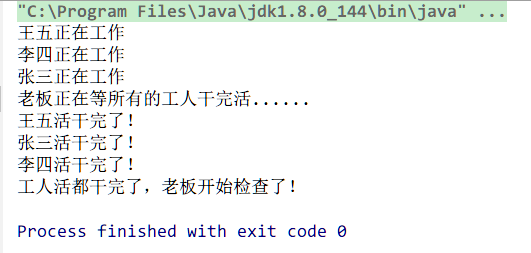
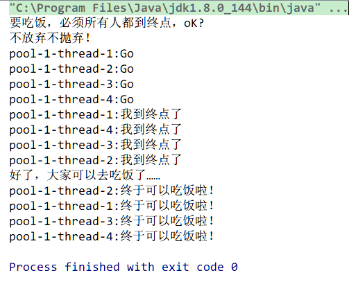
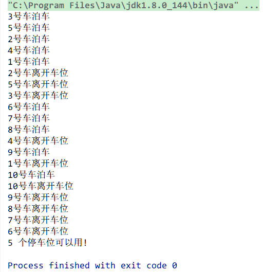
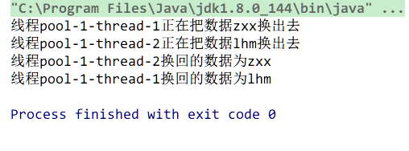

> 每次看校招Java岗位要求里面写，有高并发开发经验优先，我都很好奇，拥有高并发开发经验？学校的学生怎么接触到高并发开发环境？只看过几本书，校招简历里写熟悉高并发是不是有点作死？
>
> 知乎上有这么一个问题：https://www.zhihu.com/question/21177474
>
> 大概说的是，如果暂时接触不到具体的高并发环境，可以先读些大牛的博客，了解BAT之类的公司处理高并发的业务逻辑；自己动手写些小demo，了解常用并发工具类的使用；了解如何模拟高并发环境；

本文写一些常用的并发工具类的使用。

<!-- more -->

## CountDownLatch

CountDownLatch是一个同步倒数计数器。CountDownLatch允许一个或多个线程等待其他线程完成操作。

CountDownLatch对象内部存有一个整数作为计数器。调用countDown()方法就将计数器减1，当计数到达0时，则所有等待者会停止等待。

计数器的操作是原子性的。

### 常用API

#### 构造方法

> CountDownLatch(int count)           //  构造方法参数指定了计数的次数。

#### 方法

> void await()                //  使当前线程在锁存器倒计数至0之前一直等待，除非线程被中断。
>
> boolean await(long timeout, TimeUnit unit)             //  使当前线程在锁存器倒计数至0之前一直等待，除非线程被中断或超出了指定的等待时间。
>
> void countDown()                  // 计数减1。当计数为0，则释放所有等待的线程。
>
> long getCount()                      // 返回当前计数。
>
> String toString()                     // 返回标识此锁存器及其状态的字符串。

### 使用

用给定的计数初始化 CountDownLatch实例。每调用一次countDown()方法，计数器减1。计数器大于0 时，await()方法会阻塞其他线程继续执行。 利用该特性，可以让主线程等待子线程的结束。

需要注意的是，一旦CountDownLatch的计数到0，则无法再将该计数无法被重置。即该计数器只能使用一次。

### 示例

有三个工人在为老板干活。老板有一个习惯，当三个工人把一天的活都干完了的时候，他就来检查所有工人所干的活。如下代码设计两个类，Worker代表工人，Boss代表老板。

```java
public class CountDownLatchTest2 {
    public static void main(String[] args) {
        ExecutorService executor = Executors.newCachedThreadPool();
        CountDownLatch latch = new CountDownLatch(3);    // 同步倒数计数器。

        Worker w1 = new Worker(latch, "张三");
        Worker w2 = new Worker(latch, "李四");
        Worker w3 = new Worker(latch, "王五");
        Boss boss = new Boss(latch);

        executor.execute(w3);    // 工人工作。
        executor.execute(w2);
        executor.execute(w1);
        executor.execute(boss);    // 老板工作。

        executor.shutdown();
    }
}

class Worker implements Runnable {
    private CountDownLatch downLatch;
    private String name;

    public Worker(CountDownLatch downLatch, String name) {
        this.downLatch = downLatch;
        this.name = name;
    }

    @Override
    public void run() {
        this.doWork();
        try {
            TimeUnit.SECONDS.sleep(new Random().nextInt(10));  // 工作时长。
        } catch (InterruptedException e) {
            e.printStackTrace();
        }

        System.out.println(this.name + "活干完了！");
        this.downLatch.countDown();  // 计数减1。
    }

    private void doWork() {
        System.out.println(this.name + "正在工作");
    }
}

class Boss implements Runnable {
    private CountDownLatch downLatch;

    public Boss(CountDownLatch downLatch) {
        this.downLatch = downLatch;
    }

    public void run() {
        System.out.println("老板正在等所有的工人干完活......");
        try {
            this.downLatch.await();    // 当计数不为0时，线程永远阻塞。为0则继续执行。
        } catch (InterruptedException e) {
            e.printStackTrace();
        }

        System.out.println("工人活都干完了，老板开始检查了！");
    }

}
```

### 结果



可以看到，boss 线程一直阻塞，直到所有 worker 线程运行结束。

### 注意

CountDownLatch 实例本质与 Thread 的 join 方法相同。但 join 方法仅可以支持当前线程等待一个线程的结束，若需要等待多个线程，则需要逐个线程的调用join方法，非常麻烦。CountDwonLatch可以很方便的实现一个线程等待多个线程。


## CyclicBarrier

CyclicBarrier 用于让一组线程运行并互相等待，直到共同到达一个公共屏障点 (common barrier point，又被称为同步点)，被屏障拦截的所有线程就会继续执行。

CyclicBarrier 与 CountDownLatch的功能非常类似。但一个 CyclicBarrier 实例在释放等待线程后可以继续使用。让下一批线程在屏障点等待。但 CountDownLatch 实例只能被使用一次。所以CyclicBarrier被称为循环的 barrier。

典型的比如公司的人员利用集体郊游，先各自从家出发到公司集合，再同时出发游玩，在指定地点集合。

CyclicBarrier表示大家彼此在某处等待，集合好后才开始出发，分散活动后又在指定地点集合碰面。

### 常用 API

#### 构造器

> CyclicBarrier(int parties)             创建CyclicBarrier对象，*parties* 表示屏障拦截的线程数量。
>
> CyclicBarrier(int parties, Runnable barrierAction)         创建 CyclicBarrier对象，该构造方法提供了一个 Runnable  参数，在一组线程中的最后一个线程到达之后，执行 Runnable中 的程序，再之后释放正在等待的线程。Runnable在屏障点上只运行一次。

#### 方法

> int await()            // 通知CyclicBarrier实例，当前线程已经到达屏障点，然后当前线程将被阻塞。
>
> int await(long timeout, TimeUnit unit)         // 指定当前线程被阻塞的时间。
>
> int getNumberWaiting()                 // 返回当前在屏障处等待的线程数。
>
> int getParties()                                 // 返回CyclicBarrier的需要拦截的线程数。
>
> boolean isBroken()                          // 查询此屏障是否处于损坏状态。
>
> void reset()                                       // 将屏障重置为其初始状态。

### 示例

几个学生决定一起锻炼跑步，跑完步以后再一起去吃饭。

```java
public class CyclicBarrierTest {

    public static void main(String[] args) throws InterruptedException {
        ExecutorService exec = Executors.newCachedThreadPool();
        final CyclicBarrier barrier = new CyclicBarrier(4, new Runnable() {

            @Override
            public void run() {
                System.out.println("好了，大家可以去吃饭了……"  );
            }
        });

        System.out.println("要吃饭，必须所有人都到终点，oK?");
        System.out.println("不放弃不抛弃！");

        for (int i = 0; i < 4; i++) {
            exec.execute(new Runnable() {

                @Override
                public void run() {
                    System.out
                            .println(Thread.currentThread().getName() + ":Go");
                    try {
                        Thread.sleep((long) (2000 * Math.random()));
                    } catch (InterruptedException e1) {
                        e1.printStackTrace();
                    }
                    System.out.println(Thread.currentThread().getName()
                            + ":我到终点了");
                    try {
                        barrier.await();
                    } catch (InterruptedException e) {
                        e.printStackTrace();
                    } catch (BrokenBarrierException e) {
                        e.printStackTrace();
                    }

                    System.out.println(Thread.currentThread().getName()
                            + ":终于可以吃饭啦！");

                }
            });
        }
        exec.shutdown();
    }
}
```

### 结果



对于失败的同步尝试，CyclicBarrier 使用了一种要么全部要么全不 (all-or-none) 的破坏模式：如果因为中断、失败或者超时等原因，导致线程过早地离开了屏障点，那么在该屏障点等待的其他所有线程也将通过 BrokenBarrierException（如果它们几乎同时被中断，则用 InterruptedException）以反常的方式离开。


## Semaphore

Semaphore用于控制并发线程数。

Semaphore实例可以控制当前访问自身的线程个数。使用Semaphore可以控制同时访问资源的线程个数。例如，实现一个文件允许的并发访问数。

Semaphore维护了一个许可集。“许可”即线程进入临界区的许可，一个临界区可以有多个许可，获取许可的线程即可进入。

通过 acquire() 获取一个许可，如果线程没有获取到就等待，而 release() 表示释放一个许可。可以把Semaphore看成是一种共享锁。Semaphore允许同一时间多个线程同时访问临界区。

生活的理解：Semaphore实现的功能就类似银行有五个营业窗口，假如有十个人要办理业务，那么同时能有多少个人去柜台办理呢？同时只能有5个人能够占用，当5个人中的任何一个人完成离开后，其中在等待的另外5个人中又有一个可以占用了。另外等待的5个人中可以是随机获得优先机会，也可以是按照先来后到的顺序获得机会，这取决于构造Semaphore对象时传入的参数选项。

Semaphore对象也可以实现互斥锁的功能，并且可以是由一个线程获得了"锁"，再由另一个线程释放"锁"，这可应用于死锁恢复的一些场合。

在一些企业系统中，开发人员经常需要限制未处理的特定资源请求（线程/操作）数量，事实上，限制有时候能够提高系统的吞吐量，因为它们减少了对特定资源的争用。尽管完全可以手动编写限制代码，但使用 Semaphore类可以更轻松地完成此任务，它将帮您执行限制。

### 常用 API

> public void acquire()                   // 获取许可
>
> public void acquireUninterruptibly()
>
> public boolean tryAcquire()
>
> public boolean tryAcquire(long timeout, TimeUnit unit)
>
> public void release()                           // 释放许可。该方法一般调用于finally块中。

### 示例

一个停车场有 5 个车位，此时有 10 辆车要停靠。

```java
class Car implements Runnable {
    private final Semaphore parkingSlot;
    private int carNo;

    public Car(Semaphore parkingSlot, int carNo) {
        this.parkingSlot = parkingSlot;
        this.carNo = carNo;
    }

    public void run() {
        try {
            parkingSlot.acquire();    // 车尝试获取"车位"
            parking();
            sleep(300);
            leaving();
        } catch (InterruptedException e) {
            e.printStackTrace();
        } finally {
            parkingSlot.release();    // 释放"车位"
        }
    }

    private void parking() {
        System.out.println(String.format("%d号车泊车", carNo));
    }

    private void leaving() {
        System.out.println(String.format("%d号车离开车位", carNo));
    }

    private static void sleep(long millis) {
        try {
            Thread.sleep(millis);
        } catch (InterruptedException e) {
            e.printStackTrace();
        }
    }

}


public class SemaphoreTest2 {
    private static final int NUMBER_OF_CARS = 10;
    private static final int NUMBER_OF_PARKING_SLOT = 5;

    public static void main(String[] args) {
        Semaphore parkingSlot = new Semaphore(NUMBER_OF_PARKING_SLOT, true);    // "车位",采用FIFO,设置true。


        ExecutorService service = Executors.newCachedThreadPool();    // 创建线程池。模拟10辆车"停车"。
        for (int carNo = 1; carNo <= NUMBER_OF_CARS; carNo++) {
            service.execute(new Car(parkingSlot, carNo));
        }

        sleep(3000);
        service.shutdown();    // 关闭线程池。

        // 输出剩余可以用的资源数。
        System.out.println(parkingSlot.availablePermits() + " 个停车位可以用!");
    }

    private static void sleep(long millis) {
        try {
            Thread.sleep(millis);
        } catch (InterruptedException e) {
            e.printStackTrace();
        }
    }

}
```

### 结果



## Exchanger

Exchanger用于实现线程间的数据交换。Exchanger提供一个同步点，在同步点上，两个线程使用exchange方法交换彼此数据。如果第一个线程先执行exchange方法，则它会等待第二个线程执行exchange方法。当两个线程同时到达同步点时，这两个线程即可以交换数据。交换完毕后，各自进行以后的程序流程。当两个线程通过Exchanger交换数据的时候，这个交换对于两个线程来说是线程安全的。

exchange()方法将本线程的数据作为参数，传递给伙伴线程，并且该方法返回伙伴线程提供的数据。

当在运行不对称的活动时Exchanger很有用，比如当一个线程填充了buffer，另一个线程从buffer中消费数据时，这两个线程可以用Exchanger来交换数据。

### 常用 API

#### 构造器

> Exchanger()               // 创建一个新的 Exchanger。

#### 方法

> V exchange(V x)         // 等待另一个线程到达此交换点（除非当前线程被中断），然后将给定的对象传送给该线程，并接收该线程的对象。
>
> V exchange(V x, long timeout, TimeUnit unit)       // 等待另一个线程到达此交换点（除非当前线程被中断，或者超出了指定的等待时间），然后将给定的对象传送给该线程，同时接收该线程的对象。

### 示例

### 两个线程交互数据

```JAVA
public class ExchangerTest {
    public static void main(String[] args) {
        ExecutorService service = Executors.newCachedThreadPool();

        final Exchanger exchanger = new Exchanger();

        service.execute(new Runnable(){
            public void run() {
                try {
                    String data1 = "zxx";
                    System.out.println("线程" + Thread.currentThread().getName() +
                            "正在把数据" + data1 +"换出去");

                    Thread.sleep((long)(Math.random()*1000));

                    String data2 = (String)exchanger.exchange(data1);
                    System.out.println("线程" + Thread.currentThread().getName() +
                            "换回的数据为" + data2);
                } catch(Exception e){
                    e.printStackTrace();
                }
            }
        });

        service.execute(new Runnable(){
            public void run() {
                try {
                    String data1 = "lhm";
                    System.out.println("线程" + Thread.currentThread().getName() +
                            "正在把数据" + data1 +"换出去");

                    Thread.sleep((long)(Math.random()*1000));

                    String data2 = (String)exchanger.exchange(data1);
                    System.out.println("线程" + Thread.currentThread().getName() +
                            "换回的数据为" + data2);

                } catch(Exception e){
                    e.printStackTrace();
                }
            }
        });

        service.shutdown();
    }
}
```

