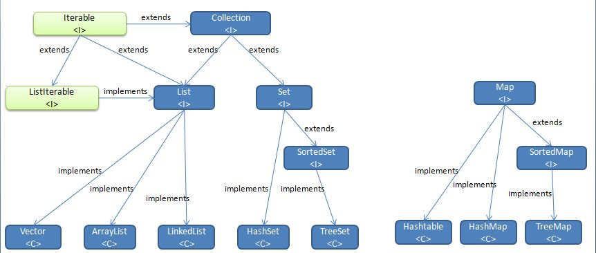

> 前面那篇面试总结的第二部分强调了Java集合的细节问题，这部分当时只是简单看了下用法，没有思考细节问题，还是得好好分析一下。

本系列文章主要参考李刚《Java程序员的基本素养》和谢宇《Java特种兵》，写得挺好，推荐一下。

本文主要对 Java 集合的基础知识进行梳理，后面陆续会谈一些细节性问题。

<!-- more -->

## 概述

首先还是让先我们对 Java 集合的大体框架有初步的认识。如下图所示：


- Collection 接口是集合类的根接口，Java 中没有提供这个接口的直接的实现类。但是却让其被继承产生了两个接口，就是 Set 和 List。Set 中不能包含重复的元素。List 是一个有序的集合，可以包含重复的元素，提供了按索引访问的方式。Array 是 Java 提供的队列实现，有些类似于 List。
- Map 是 Java.util 包中的另一个接口，它和 Collection 接口没有关系，是相互独立的，但是都属于集合类的一部分。Map 包含了 key-value 对。Map 不能包含重复的 key，但是可以包含相同的 value。
- Iterator，所有的集合类，都实现了 Iterator 接口，这是一个用于遍历集合中元素的接口，主要包含以下四种方法：
  - boolean hasNext() 是否还有下一个元素。
  - Object next() 返回下一个元素。
  - void remove() 删除当前元素。
  - void forEachRemaining(Consumer action)  Java8新增的默认方法，可以使用 Lambda 表达式来遍历集合元素。

### 集合的特点

- 集合中的每一个元素都是对象，存储的实际上是对象的引用。
- 集合长度可扩展，并且是自动的。
- 根据数据结构的不同，集合分为很多种，每一种都有各自的特点。
- 集合的最上层是 Collection 接口，集合最基本的增删改查方法均在该接口中有所体现。
- 集合中如果没有使用泛型，则默认存储的是 Object 类，所有的对象均向上转型存入集合，取出使用时需要向下转型，并可能有类型转换异常。所以建议配合泛型使用集合。


## Collection

### 常用方法

- 添加
  boolean  add(E e)
  boolean  addAll(Collection<? extends E> c)

- 删除
  boolean  remove(Object o)
  boolean  removeAll(Collection<?> c)
  boolean  retainAll(Collection<?> c)

- 判断是否包含
  boolean  contains(Object o)
  boolean  containsAll(Collection<?> c)

- 清空
  void  clear()

- 获取迭代器
  Iterator<E>  iterator()

- 判断空和获取大小
  boolean  isEmpty()
  int  size()

- 将集合转换为数组

  Object[] toArray()


先分别简单介绍一下 Set 和Map 集合。

## Set 集合

### 特点

Set 集合中的元素是唯一的，不可重复（取决于 hashCode 和 equals 方法），也就是说具有唯一性。
Set 集合中元素不保证存取顺序，并不存在索引。

### 继承关系

Collection

```
|--Set：元素唯一，不保证存取顺序，只可以用迭代器获取元素。

    |--HashSet：哈希表结构，非线程安全，查询速度较快。元素唯一性取决于 hashCode 和 equals 方法。
    
        |--LinkedHashSet：带有双向链表的哈希表结构，非线程安全，保持存取顺序，保持了查询速度较快特点。
        
    |--TreeSet：平衡排序二叉树（红黑树）结构，非线程安全，按自然排序或比较器存入元素以保证元素有序。
                元素唯一性取决于 ComparaTo 方法或 Comparator 比较器。
```


### 常用方法

Set 集合的方法和 Collection 集合的方法几乎一致。


## HashSet

### 特点

- 元素具有唯一性，取决于 hashCode 和 equals 方法。
- 元素不保证存取顺序。
- 由于采用哈希表数据结构，所以查询较快。
- 与 List 一样，建议使用多态的方式，创建 HashSet 集合并使用 Set 接口方法。


### 关于 hashCode 和 equals 方法

- 在以哈希表为数据结构的容器中，其存放地址取决于 hashCode 方法计算的值，如果 hashCode 的值相同，则用 equals 方法判断是否相同，如果都相同则判定为相同元素。
- 在以哈希表为数据结构的容器使用过程中，已经加入的元素不可以变更 hashCode 方法所依赖的域的值，否则会导致元素 hashCode 值已变化，但是其在容器中的位置却没有变化，后果是接下来的 remove 等操作将因为无法找到该元素而移除失败，进一步导致内存泄露。

HashSet 集合判断两个元素相等的标准是：两个对象通过 equals() 方法比较相等，并且 hashCode() 方法返回值也相等。


## LinkedHashSet

### 特点

- HashSet 集合具有的优点 LinkedHashSet 集合都具有。
- LinkedHashSet 集合在 HashSet 查询速度快的前提下，能够保持元素存取顺序。


## TreeSet

### 特点

- 元素具有唯一性，取决于 Comparable.compareTo 方法或比较器 Comparator。
- 元素不保证存取顺序。
- **由于采用平衡排序二叉树，所以保存的元素均有序。**
- 与 List 一样，建议使用多态的方式，创建 TreeSet 集合并使用 Set 接口方法。
- 创建 TreeSet 集合时，必须保证元素已经实现 Comparable 接口或者传入比较器 Comparator。

### 比较器

1. Comparable 接口

   自定义类如果实现该接口，那么重写该接口唯一的方法 compareTo(E)，可以让该类具有可比较性。

2. Comparator 接口

   实现该接口的类被称之为比较器，一般只具有一个方法，就是重写的这个接口的 compare(E o1, E o2) 方法，实现两个对象之间的比较。

   TreeSet 集合判断两个对象相等的唯一标准是：两个对象通过 compareTo() 方法比较返回值是否为 0，如果是，则认为它们相等。

**如果希望 TreeSet 正常工作，TreeSet 只能添加同一类型的对象。**


## EnumSet

### 特点

- EnumSet 是专门为枚举类设计的集合类，其中所有元素必须是指定枚举类型的枚举值。
- EnumSet 在内部以位向量的形式存储，运行效率高。
- EnumSet 不允许加入 null 元素。


## 性能分析

- HashSet 的性能总是优于 TreeSet，因为 TreeSet 需要额外的红黑树来维护集合元素的次序。
- LinkedHashSet 对于普通的插入删除操作要慢于 HashSet，因为要维护链表，但也因此遍历更快。
- EnumSet 性能最优，但只能保存同一枚举类的枚举值为集合元素。
- Set 的三个实现类都是线程不安全的。多线程操作 Set 集合时，需要手动保证同步性。


好了，说完 Set 让我们开始聊 Map，为什么 Map 会和 Set 放在一起呢？让我们先看一张图



比较 Set 和 Map 部分，发现没有？继承结构很相似。这种相似性肯定是有原因的，这点我们后面会说到。


## Map 集合

### 概述

Map<K, V> 集合是一个接口，和 Collection 集合不同的是，它是双列集合，也就是说它所存储的是键值对。

### 特点

- Map 集合存储的是键值对，其中键要求唯一。
- Map 集合的键对应一个值，值不要求唯一，但是一个键不能对应对个值。
- Map 集合没有 Iterator 迭代器，如果需要迭代需要转化为单列集合间接迭代。

### 继承关系

```
Map

|--Hashtable：哈希表结构，不保证存取顺序，不允许 null 键或者 null 值，线程安全，效率较低，已被 HashMap 替代

	|--Propertise：键值对均是 String 类型的 Map 集合，包括直接对流操作的方法，专为配置文件而生

|--HashMap：哈希表结构，不保证存取顺序，允许 null 键和 null 值，非线程安全，效率较高

	|--LinkedHashMap：带双向链表的哈希表结构，保持存取顺序，允许 null 键和 null 值，非线程安全，效率较高。

|--TreeMap：平衡排序二叉树（红黑树）结构，按自然排序或比较器存入元素以保证元素有序，非线程安全。
```

元素唯一性取决于 ComparaTo 方法或 Comparator 比较器。


### 常用方法

Map 集合的方法一部分和 Set 集合类似。

- 添加键值对
  V  put(K key, V value)
- 根据键获取值
  V  get(Object key)
- 判断是否包含键或者值
  boolean  containsKey(Object key)
  boolean  containsValue(Object value)
- 删除对应键值对
  V  remove(Object key)
  default boolean  remove(Object key, Object value)
- 替换新值
  default V  replace(K key, V value) // 返回老值
  default boolean  replace(K key, V oldValue, V newValue)
- 获取 entrySet（包含所有键值对的 Map 对象的 Set 集合）
  Set<Map.Entry<K,V>>  entrySet()
- 获取包含所有键的 Set 集合
  Set<K>  keySet()
- 获取包含所有值的 Collection 集合
  Collection<V>  values()

Map.Entry 是 Map 接口中的内部接口，因为依托 Map 集合存在而存在，并且由于该接口能够获取 Map 集合中的所有键值对，所以定义在内部。


### 迭代

- 使用 entrySet 集合
- 使用 keySet 集合


## HashMap & TreeMap 

### 特点

- 其方法和思想均和 HashSet 以及 TreeSet 高度类似，可以参照。
- HashMap 的键保持唯一性，取决于 hashCode 以及 equals 方法。
  TreeMap 的键保持唯一性，取决于比较方法和比较器。


## Properties

### 特点

- Properties 集合表示了一个持久的属性集。
- Properties 集合键值对均是 String 类型。
- Properties 集合可以直接从一个流中读取数据，也可以直接保存到一个流中。
- 强烈建议 Properties 集合只存储 String 类型的数据，尽管可以利用其父类方法存储其他类型数据。

### 常用方法

- 添加属性值

  Object  setProperty(String key, String value)

- 获取属性值

  String  getProperty(String key)
  String  getProperty(String key, String defaultValue)

- 获取所有属性

  Set<String>  stringPropertyNames()

- 打印所有属性和属性值

  void  list(PrintStream out)
  void  list(PrintWriter out)

- 将属性集存储到流中（可以使用 XML 方式）

  void  store(OutputStream out, String comments)
  void  store(Writer writer, String comments)
  void  storeToXML(OutputStream os, String comment)
  void  storeToXML(OutputStream os, String comment, String encoding)

- 从流中读取属性集（可以使用 XML 方式）

  void  load(InputStream inStream)
  void  load(Reader reader)
  void  loadFromXML(InputStream in)

  ​


现在我们谈谈 Set 和 Map 的关系。

## 联系

Set 和 Map 之间的关系非常密切。虽然 Map 中存放的元素是 key-value 对，Set 中放的元素是单个对象，但如果把 key-value 对中的 value 当成 key 的附庸，那么就可以像对待 Set 一样对待 Map 了。

事实上， Map 提供了一个 Entry 内部类来封装 key-value 对，而计算 Entry 存储时只考虑 Entry 封装的 key。

从 Java 源码来看，Java 是先实现了 Map，然后通过包装一个所有 value 值都为 null 的 Map 就实现了 Set 集合。


## List 集合

### 特点

- List 集合支持修改方法，该方法 Collection 不具备。
- List 集合中元素按存取顺序存储，即保持存取顺序。
- List 集合是自带索引的，所以除了迭代器获取元素方法外，还可以使用遍历 + get(int index) 方法来获取元素。
- List 集合元素可重复。

### 继承关系

```
Collection

|--List

	|--ArrayList：数组结构，非线程安全，查询较快，增删较慢。

	|--LinkedList：双向链表结构，非线程安全，增删较快，查询较慢（按序号索引数据需要进行向前或向后遍历）。

	|--Vector：数组结构，线程安全，效率较低，已被 ArrayList 替代。

		|--Stack：栈

```


### 常用方法

由于继承了Collection 接口，所以可以使用 Collection 接口的所有方法。又因为 List 是有序集合，所以额外增加了一些根据索引操作集合的方法。

- 插入元素

  void  add(int index, E element)
  boolean  addAll(int index, Collection<? extends E> c)

- 按索引获取元素

 ​E  get(int index)

- 获取指定元素的索引

  int  indexOf(Object o)
  int  lastIndexOf(Object o)

- 获取 ListIterator 迭代器

  ListIterator<E>  listIterator()

- 按索引删除元素

  E  remove(int index)

- 修改元素

  E  set(int index, E element)

- 对元素排序，需要元素实现 Comparator 接口以具有可比性

  default void  sort(Comparator<? super E> c)

- 按索引获取子集合

  List<E>  subList(int fromIndex, int toIndex)

  ​

## listIterator 迭代器

### 常用方法

- 添加元素

  void  add(E e)

- 判断集合中是否有下一个元素

  boolean  hasNext()

- 判断集合中是否有上一个元素

  boolean  hasPrevious()

- 获取下一个元素

  E  next()

- 获取下一个元素的索引

  int  nextIndex()

- 获取上一个元素

  E  previous()

- 获取上一个元素的索引

  int  previousIndex()

- 移除元素

  void  remove()

- 修改元素

  void  set(E e)

### 注意

- Iterator 迭代器中只有获取方法，没有增删改方法。而 ListIterator 支持增删改操作，并支持向前遍历。

- 在迭代过程中，使用了集合的方法对元素进行操作，导致迭代器并不知道集合中的变化，引发数据的不确定性。
  例如

  ````java
  for (Iterator it = list.iterator(); it.hasNext();) {  
  	if ("heima2".equals(it.next())) {    
  		list.add("java");  
  	}
  }
  ````

  报 java.util.ConcurrentModificationException 异常。
  所以在迭代时，不要使用集合的方法操作元素，可以使用迭代器的方法操作。ListIterator 支持增删改可以解决该问题。
  注意：该列表迭代器只有 List 接口有，而且这个迭代器可以完成在迭代过程中的增删改查动作。

- 迭代过程中，增删改动作最多只能有 1 个，不可以两个同时进行。否则迭代器迭代序列可能出错，报 java.lang.IllegalStateException 异常。


## ArrayList

### 特点

是 List 接口的实现类，用以替代 Vector 集合，并且具有比后者更高的效率，但是不保证线程安全。

### 注意

- List 是接口，ArrayList 是实现类。
- 一般使用多态的方式创建集合，如：
  List<E> list = new ArrayList<E>();
  这样使得集合具有更高的适用性。


## LinkedList 

### 特点

- 是 List 接口的实现类，双向链表结构，所以增删效率较高，可以用以实现队列或栈的数据结构。
- LinkedList 动作特点均可以围绕头和尾展开。

### 队列实现

特点是先进先出 FIFO 数据结构，可以选择头插尾取，也可以选择尾插头取。

```java
package collection.structure;
 
import java.util.LinkedList;
import java.util.ListIterator;
 
public class Queue<E> {
  private LinkedList<E> link;
 
  public Queue() {
    link = new LinkedList<E>();
  }
 
  public boolean isEmpty() {
    return link.isEmpty();
  }
 
  public void print() {
    for (ListIterator<E> it = link.listIterator(link .size()); it .hasPrevious();) {
      System.out.println( it.previous());
    }
  }
 
  public void enQueue(E obj) {
    link.addFirst( obj);
  }
 
  public E deQueue() {
    return link.removeLast();
  }
}
```

### 栈实现

特点是先进后出 FILO 数据结构，可以选择头插头取，也可以选择尾插尾取。

```java
package collection.structure;
 
import java.util.LinkedList;
import java.util.ListIterator;
 
public class Stack<E> {
    private LinkedList<E> link;
 
    public Stack() {
        link = new LinkedList<E>();
    }
   
    public boolean isEmpty() {
        return link .isEmpty();
    }
   
    public void print() {
        for (ListIterator<E> it = link.listIterator(link .size()); it .hasPrevious();) {
            System. out.println(it .previous());
        }
    }
   
    public void push(E obj) {
        link.addFirst( obj);
    }
   
    public E pop() {
        return link.removeFirst ();
    }
}
```


## Vector 

只需要知道其是线程安全的即可，由于比较古老，性能较差，目前已被 ArrayList 取代。

事实上，即使在需要保证 List 集合线程安全的情况下，我们也不推荐使用 Vector 实现类，Collections 工具类可以将一个 ArrayList 变成线程安全的。

### Stack

Vector 提供了一个 Stack 子类，用于模拟栈。

由于其继承了 Vector ，所以它也是一个古老的集合类，线程安全但性能较差。目前也已经被 ArrayDeque 取代。


## Deque 集合类

### Deque

### ArrayDeque

### LinkedList


## 线性表性能分析

一般来说，由于数组以一块连续内存区域来保存所有的数组元素，所以数组在随机访问时性能最好。

- 所有内部以数组作为底层实现的集合在随机访问时性能都比较好。
- 内部以链表作为底层实现的集合在执行插入、删除操作时有比较好的性能。

但总体来说，ArrayList 的性能比 LinkedList 的性能要好，因此大部分时候应考虑使用 ArrayList。


## 使用建议

- 如果需要遍历 List 集合元素，对于 ArrayList、Vector 集合，应该使用随机访问方法（get）来遍历集合元素；对于 LinkedList 集合，则应该采用迭代器（Iterator）来遍历。
- 如果经常要执行插入 、删除操作来改变包含大量数据的 List 集合的大小，可以考虑使用 LinkedList。
- 如果有多个线程需要同时访问 List 集合元素，可以考虑使用 Collections 工具类将集合包装成线程安全的集合。


OK，终于写完了，开心！