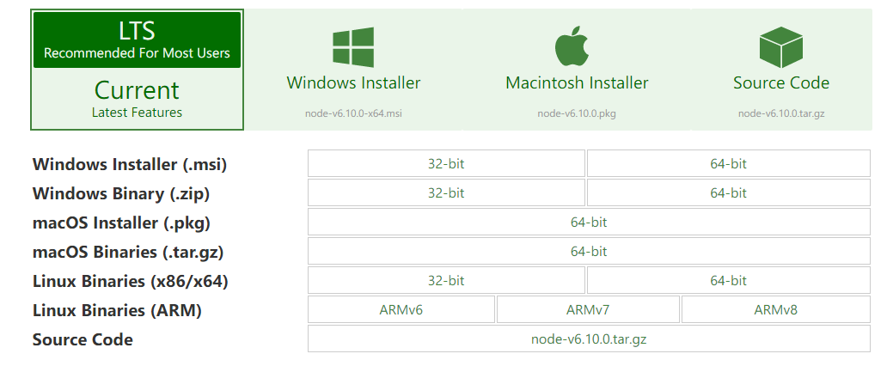
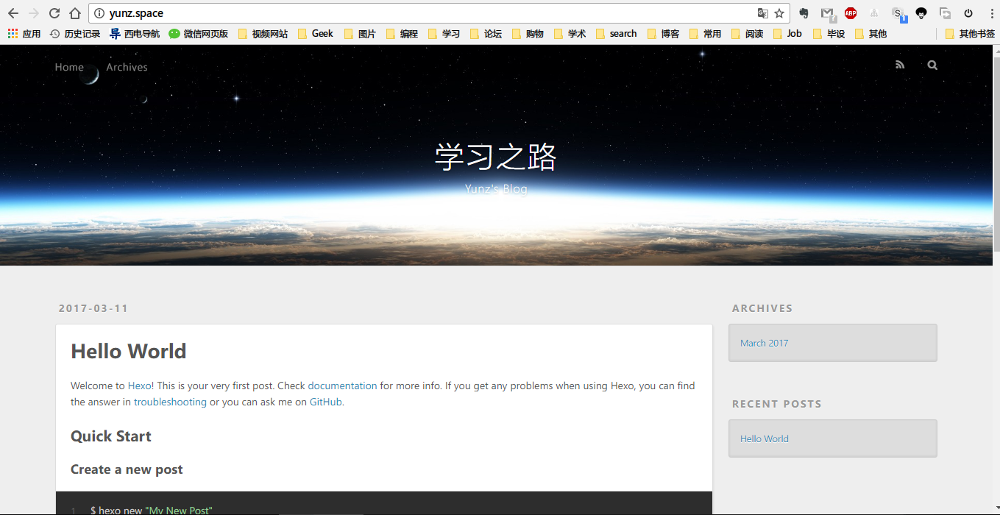

> 最近在学习linux，想把 hexo 环境搬到linux上，安装过程中遇到了不少坑，记录一下。结合了很多人的博客教程，不一一说明了，非常感谢。
>
> 说明一下，我使用的是 Bash on Ubuntu on Windows，所以有些坑应该只有我会遇到==。一般人在Ubuntu的环境下应该会容易很多。

windows 下请参考这篇教程：很详细 [[零基础免费搭建个人博客-hexo+github ](http://blog.csdn.net/jzooo/article/details/46781805)](http://blog.csdn.net/jzooo/article/details/46781805)

<!-- more -->

## 准备条件：

### 1. 安装 Node.js 和 npm



linux 下安装 Node.js 有以下三种方法：

- 下载已编译好的源码，即`Linux Binaries`，根据自己电脑类型下载后缀为`.tar.xz`的压缩文件，自行解压

  ```powershell
  yunz@MAHE-PC ~/apps> cd node-v6.10.0-linux-x64/bin/
  ./node -v
  ```

  因为是已编译好的文件，所以此时bin文件夹中已经有了node和npm，但是是非全局的，我们需要将其设置为全局的。

  设置全局有两种方法：

  - 软连接

    ```powershell
    yunz@MAHE-PC ~/apps> sudo ln -s /home/yunz/apps/node-v6.10.0-linux-x64/bin/node /usr/local/bin/node
    yunz@MAHE-PC ~/apps> sudo ln -s /home/yunz/apps/node-v6.10.0-linux-x64/bin/npm /usr/local/bin/npm
    ```

  - 配置环境变量

    在 node 目录下执行 pwd 获取 node 所在的目录，要把这个目录添加到 PATH 环境变量，修改`/etc/profile`文件

    ```powershell
    PATH=$PATH:/home/yunz/apps/node-v6.10.0-linux-x64/bin/

    ```

  设置完成以后即可再全局使用 node 和 npm 命令。

  ​

- 自行下载源码进行编译（麻烦）

  这里可以参考[Linux 下 Nodejs 安装](https://my.oschina.net/blogshi/blog/260953)


- apt-get install node.js （不推荐）

  ```powershell
  sudo apt-get install nodejs
  sudo apt-get install npm
  ```

  这个方法很坑，安装的 node.js 不是最新版，不建议使用。

  ​

## 2. 安装 git

Ubuntu bash 自带 git，这一步可以跳过。windows上参考文章开始处推荐的教程。

git 的基本使用教程，推荐[廖雪峰的Git 教程](http://www.liaoxuefeng.com/wiki/0013739516305929606dd18361248578c67b8067c8c017b000/)。


## 3. 安装 hexo

安装 hexo 经常会出现网络问题，因为 qiang 的原因，所以推荐使用淘宝的npm镜像，或者自备梯子。

```powershell
npm install -g cnpm --registry=https://registry.npm.taobao.org
```

使用官方镜像安装 hexo

```powershell
npm install -g hexo-cli
```

使用淘宝镜像安装 hexo

```powershell
cnpm install -g hexo-cli
```

然后等待安装完成即可。

这里我遇到了两个问题，其实是一个问题，即 npm 安装 cnpm 和 hexo 以后，均无法使用该命令。这里需要像前面第一步一样，设置一下二者的全局。估计是 Bash on Ubuntu on Windows 的问题。

```powershell
yunz@MAHE-PC ~/apps> sudo ln -s /home/yunz/apps/node-v6.10.0-linux-x64/bin/cnpm /usr/local/bin/cnpm
yunz@MAHE-PC ~/apps> sudo ln -s /home/yunz/apps/node-v6.10.0-linux-x64/bin/hexo /usr/local/bin/hexo
```


## 4.  运行 hexo

- 创建一个 hexo 项目blog	

  ```powershell
  cp hexo
  hexo init blog
  ```

- 编辑`_config.yml`配置博客基本信息

  这里需要注意 deploy 的配置

  ```powershell
  deploy: 
    type: git
    repository: https://github.com/username/username.github.io.git
    // repository: git@github.com:username/username.github.io.git 推荐这种
    branch: master
  ```

- 安装 hexo git 插件

  ```powershell
  cnpm install hexo-deployer-git --save
  ```

- 写一篇新的文章

  ```powershell
  hexo new "Hello hexo"
  ```

- 发布文章

  ```powershell
  hexo d -g
  ```


## 5. 绑定域名

注册域名这一步就不说了。

在 github pages 的 repository 中根文件夹下新建 CNAME 文件，文件中写上你自己的域名。

> 但这种方式每次 hexo 部署的时候，CNAME文件都会被冲掉，每次都要重写，肯定不可行。
>
> 解决方法：在 hexo 文件夹的 source 文件夹中建立 CNAME 文件。


配置域名解析，以万网为例。推荐[这篇博客](http://www.cnblogs.com/penglei-it/p/hexo_domain_name.html)

值得注意的是，如果你想把博客绑定到子域名上，例如 `blog.yunz.space`。CNAME 文件中的值应为 `blog.yunz.space `，然后再域名解析处添加 如下记录：


好了，大功告成！



