> 最近华为中兴开始提前批了，所以需要复习一下算法基础知识了。话说这些公司招聘越来越早了，抢人需要这么狠么。。。

今天就写写常用的排序算法吧。多多指教哟！

为了统一规范，本文所有排序算法均以升序为排序标准。

<!-- more -->

## 冒泡排序

> 冒泡排序，是一种简单的排序算法。
>
> 顾名思义，整个排序过程类似于水中气泡上升的过程。两个数比较大小，较大的数下沉，较小的数冒起来。

### 基本思想

重复地走访过要排序的数列，一次比较两个元素，如果他们的顺序错误就把他们交换过来。走访数列的工作是重复地进行直到没有再需要交换，也就是说该数列已经排序完成。

### 算法步骤

1. 从数组起始位开始，遍历数组，依次比较该位与其后一位，如果前一个比后一个大，就把它们两个调换位置。
2. 这样一次遍历之后，数组中最大的元素就被放置到数组的最后一位，则该位已被排序。
3. 再针对之前未排序的元素重复以上的步骤，直到没有任何一对数字需要比较。

这里有两张动态图，比较形象。


### 性能

|  平均情况  | 最好情况 |  最坏情况  | 辅助空间 | 稳定性  |
| :----: | :--: | :----: | :--: | :--: |
| O(n^2) | O(n) | O(n^2) | O(1) |  稳定  |

### Java 实现

#### 代码

```java
void BubbleSort(int[] arr) {
        int length = arr.length;
        int temp;

        for (int i = 0; i < length; i++) {
            System.out.println("第 " + i +" 趟排序的结果为：" + Arrays.toString(arr));

            for(int j = 1; j < length - i; j++){
                if(arr[j-1] > arr[j]){
                    swap(arr, j-1, j);
                }
            }
        }
    }
```

#### 结果

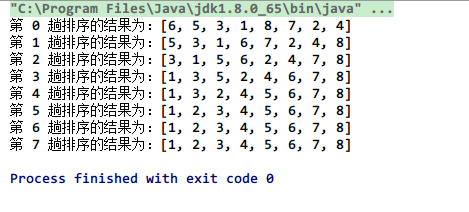

> 第 0 趟排序结果指的是原始序列。

### 改进

从上面的结果可以看出，第五趟排序之后，结果已经有序，但算法仍然进行了最后两次排序。我们可以通过设置一个标识位来判断数组是否已经有序，如果是，则终止。

#### 代码

```java
void BetterBubbleSort(int[] arr) {
        int len = arr.length;
        boolean flag;

        for (int i = 0; i < len; i++) {
            System.out.println("第 " + i +" 趟排序的结果为：" + Arrays.toString(arr));

            flag = false;
            for(int j = 1; j < len - i; j++){
                if(arr[j-1] > arr[j]){
                    swap(arr, j-1, j);
                    flag = true;
                }
            }
            if (!flag)
                break;
        }
    }
```

#### 结果

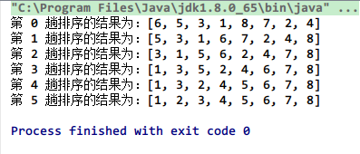

## 鸡尾酒排序

> 鸡尾酒排序也叫定向冒泡排序，是冒泡排序的改进。

### 基本思想

常见的冒泡排序是始终是按一个方向来进行排序，找到最大或者最小值。而鸡尾酒排序则是按一个方向找到最大（小）值，然后再按另外一个方向找到最小（大）值。然后交替操作，直到排序完成，类似于调制鸡尾酒时调酒杯的摇晃，因此得名。

### 算法步骤

1. 在一个方向上冒泡排序找到最大（小）值。
2. 然后再反方向上冒泡排序找到最小（大）值。
3. 交替操作，直到排序完成。


### 性能

|  平均情况  | 最好情况 |  最坏情况  | 辅助空间 | 稳定性  |
| :----: | :--: | :----: | :--: | :--: |
| O(n^2) | O(n) | O(n^2) | O(1) |  稳定  |

### Java 实现

#### 代码

```java
void CocktailSort(int[] arr) {
        int index = 0;
        int len = arr.length;
        int left = 0;
        int right = len - 1;

        while (left < right) {
            System.out.println("第 " + index +" 趟排序的结果为：" + Arrays.toString(arr));
            for (int i = left; i < right; i++)  // 前半轮,将最大元素放到后面
                if (arr[i] > arr[i + 1])
                {
                    swap(arr, i, i + 1);
                }
            right--;
            for (int i = right; i > left; i--)  // 后半轮,将最小元素放到前面
                if (arr[i-1] > arr[i])
                {
                    swap(arr, i - 1, i);
                }
            left++;
            index++;
        }
    }
```

#### 结果

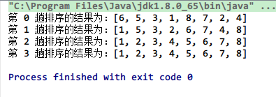

## 选择排序

> 选择排序是最简单的排序算法之一。

### 基本思想

好像没什么好说的，见算法步骤。

### 算法步骤

1. 首先在未排序序列中找到最小（大）元素，存放到排序序列的起始位置。
2. 然后，再从剩余未排序元素中继续寻找最小（大）元素，放到已排序序列的末尾。
3. 以此类推，直到所有元素均排序完毕。

​                                                                             

### 性能

|  平均情况  |  最坏情况  |  最好情况  | 辅助空间 | 稳定性  |
| :----: | :----: | :----: | :--: | :--: |
| O(n^2) | O(n^2) | O(n^2) | O(1) | 不稳定  |

### Java 实现

#### 代码

```java
void SelectionSort(int[] arr) {
        int len = arr.length;
        int min;
        System.out.println("原始序列为：" + Arrays.toString(arr));
        for (int i = 0; i < len - 1; i++) { // i 表示已排序序列的末尾
            min = i;
            // 找出未排序序列中的最小值
            for (int j = i+1; j < len; j++) {
                if (arr[j] < arr[min])
                    min = j;
            }
            // 放置到已排序序列的末尾
            if (min != i)
                swap(arr, min, i);
            System.out.println("第 " + (i+1) +" 趟排序的结果为：" + Arrays.toString(arr));
        }
    }
```

#### 结果

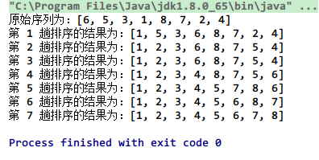

## 插入排序

> 插入排序是一种简单直观的排序算法。它的工作原理非常类似于我们码牌，将未排序牌逐一地插入到已排序牌的相应位置。

### 基本思想

在要排序的一组数中，假定前 n-1 个数已经排好序，现在将第 n 个数插到前面的有序数列中，使得这 n 个数也是排好顺序的。如此反复循环，直到全部排好顺序。

### 算法步骤

1. 从第一个元素开始，该元素可以认为已经被排序
2. 取出下一个元素，在已经排序的元素序列中从后向前扫描
3. 如果该元素（已排序）大于新元素，将该元素移到下一位置
4. 重复步骤 3，直到找到已排序的元素小于或者等于新元素的位置
5. 将新元素插入到该位置后
6. 重复步骤 2~5


### 性能

|  平均情况  | 最好情况 |  最差情况  | 辅助空间 | 稳定性  |
| :----: | :--: | :----: | :--: | :--: |
| O(n^2) | O(n) | O(n^2) | O(1) |  稳定  |

### Java 实现

#### 代码

```java
void InsertSort(int[] arr) {
        int len = arr.length;
        int a;  // 每一趟的待排序数
        System.out.println("原始序列为：" + Arrays.toString(arr));
        for (int i = 1; i < len; i++) { // 第一位元素被认为是已排序的
            a = arr[i];
            int j = i - 1;
            // 将待排序数插入到已排序序列的正确位置
            while (j >= 0 && arr[j] > a) {
                arr[j+1] = arr[j];
                j--;
            }
            arr[j+1] = a;

            System.out.println("第 " + i +" 趟排序的结果为：" + Arrays.toString(arr));
        }
    }
```

#### 结果

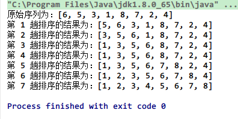

### 改进（二分插入排序）

对于已排序序列的插入，通常可以使用二分法来改进。插入排序中，将待排序元素插入到已排序序列中可以通过使用二分法来实现二分插入排序。

#### 代码

```java
void BinaryInsertSort(int[] arr) {
        int len = arr.length;
        int a;  // 每一趟的待排序数
        int left, right, middle;
        System.out.println("原始序列为：" + Arrays.toString(arr));
        for (int i = 1; i < len; i++) { // 第一位元素被认为是已排序的
            a = arr[i];
            left = 0;
            right = i - 1;

            while (left <= right) {
                middle = (left+right)/2;
                if (arr[middle] > a)
                    right = middle-1;
                else
                    left = middle+1;
            }

            for(int j=i-1; j>=left; j--)
            {
                arr[j+1] = arr[j];
            }

            arr[left] = a;

            System.out.println("第 " + i +" 趟排序的结果为：" + Arrays.toString(arr));
        }
    }
```

#### 结果


## Shell 排序

> shell 排序是插入排序的更高效改进。
>
> 希尔排序是基于插入排序的以下两点性质而提出改进方法的：
>
> - 插入排序在对几乎已经排好序的数据操作时，效率高，即可以达到线性排序的效率
> - 但插入排序一般来说是低效的，因为插入排序每次只能将数据移动一位

### 基本思想

​	希尔排序通过将比较的全部元素分为几个区域来提升插入排序的性能。这样可以让一个元素可以一次性地朝最终位置前进一大步。然后算法再取越来越小的步长进行排序，算法的最后一步就是普通的插入排序，但是到了这步，需排序的数据几乎是已排好的了（此时插入排序较快）。

### 算法步骤

1. 先取一个小于 n 的整数 d1 作为第一个增量，把文件的全部记录分成 d1 个组。
2. 所有距离为 d1 的倍数的记录放在同一个组中，在各组内进行直接插入排序。3.
3. 取第二个增量 d2<d1 重复上述的分组和排序。
4. 直至所取的增量 dt=1(dt<dt-l<…<d2<d1)，即所有记录放在同一组中进行直接插入排序为止。

### 性能

|          一般情况           | 最优情况 |  最差情况   | 辅助空间 | 稳定性  |
| :---------------------: | :--: | :-----: | :--: | :--: |
| O(nlogn)~O(n^2)，与步长选取有关 | O(n) | 与步长选取有关 | O(1) | 不稳定  |

### Java 实现

#### 代码

```java
void ShellSort(int[] arr) {
        int len = arr.length;
        int h = 0;
        int a;

        System.out.println("原始序列为：" + Arrays.toString(arr));

        h = len >> 1; // 这里初始步长选取为序列长度的一半

        while (h >= 1)
        {
            for (int i = h; i < len; i++)
            {
                int j = i - h;
                a = arr[i];
                while ((j >= 0) && (arr[j] > a))
                {
                    arr[j + h] = arr[j];
                    j = j - h;
                }
                arr[j + h] = a;
            }
            System.out.println("步长 h 为: " + h + ", 插入排序的结果为：" + Arrays.toString(arr));

            h = h >> 1; // 递减增量
        }
    }
```

#### 结果

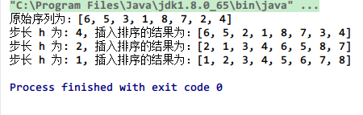

## 快速排序

> 应该是最重要的一种排序算法了。
>
> tips：为了避免最坏情况的发生，算法4中在对序列进行快排之前，先随机打乱原序列。

### 基本思想

分治思想。通过一趟排序将待排记录分隔成独立的两部分，其中一部分记录的关键字均比另一部分的关键字小，则可分别对这两部分记录继续进行排序，以达到整个序列有序。

递归思想。

### 算法步骤

1. 从序列中挑出一个元素，作为 "基准"(pivot).
2. 把所有比基准值小的元素放在基准前面，所有比基准值大的元素放在基准的后面（相同的数可以到任一边），这个称为分区 (partition) 操作。
3. 对每个分区递归地进行步骤 1~3，递归的结束条件是序列的大小是 0 或 1，这时整体已经被排好序了。


### 性能

|   一般情况   |   最优情况   |  最差情况  |     辅助空间     | 稳定性  |
| :------: | :------: | :----: | :----------: | :--: |
| O(nlogn) | O(nlogn) | O(n^2) | O(logn)~O(n) | 不稳定  |

### Java 实现

#### 代码

```java
void QuickSort(int[] arr, int left, int right) {
        if (right <= left)
            return;
		System.out.println(Arrays.toString(arr));
        int index = partition(arr, left, right);

        QuickSort(arr, left, index - 1);
        QuickSort(arr, index + 1, right);
    }

    private int partition(int[] arr, int left, int right) {
        int pivot = arr[right];                   // 选择最后一个元素作为基准
        int tail = left - 1;                      // tail为小于基准的子数组最后一个元素的索引
        for (int i = left; i < right; i++)        // 遍历基准以外的其他元素
        {
            if (arr[i] <= pivot)                  // 把小于等于基准的元素放到前一个子数组中
            {
                tail++;
                swap(arr, tail, i);
            }
        }
        swap(arr, tail + 1, right);               //最后把基准放到前一个子数组的后边,剩下的子数组既是大于基准的子数组
        return tail + 1;                          // 返回基准的索引
    }
```

#### 结果

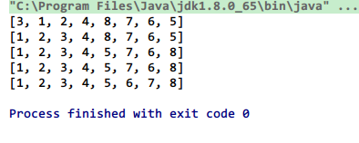

## 归并排序

> 归并排序是创建在归并操作上的一种有效的排序算法。

### 基本思想

分治思想。归并排序的实现分为**递归实现**与**非递归 (迭代) 实现**。

递归实现的归并排序是算法设计中分治策略的典型应用，我们将一个大问题分割成小问题分别解决，然后用所有小问题的答案来解决整个大问题。

非递归 (迭代) 实现的归并排序首先进行是两两归并，然后四四归并，然后是八八归并，一直下去直到归并了整个数组。

### 算法步骤

递归实现

1. Divide: 把长度为 n 的输入序列分成两个长度为 n/2 的子序列。
2. Conquer: 对这两个子序列分别采用归并排序。
3. Combine: 将两个排序好的子序列合并成一个最终的排序序列。

### 性能

|   一般情况   |   最优情况   |   最差情况   | 辅助空间 | 稳定性  |
| :------: | :------: | :------: | :--: | :--: |
| O(nlogn) | O(nlogn) | O(nlogn) | O(n) |  稳定  |


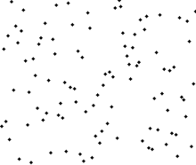

### Java 实现

#### 代码

```java
// 之所以把临时数组当做形参，是不想在递归的过程中去生成，这会生成很多临时数组，浪费资源
    void MergeSort(int[] arr, int left, int right, int[] temp) {
        if (left >= right)
            return;

        int middle = (left + right) / 2;

        MergeSort(arr, left, middle, temp);
        MergeSort(arr, middle + 1, right, temp);
        // 归并两个已排序序列
        Merge(arr, left, middle, right, temp);

        System.out.println(Arrays.toString(arr));
    }

    /**
     * 归并操作
     */
    private void Merge(int[] arr, int left, int middle, int right, int[] temp) {
        int i = left, j = middle + 1;
        int m = middle,   n = right;
        int k = 0;

        // 两个序列的值按大小顺序依次拷贝到临时数组中，完成归并
        while (i <= m && j <= n)
        {
            if (arr[i] <= arr[j])
                temp[k++] = arr[i++];
            else
                temp[k++] = arr[j++];
        }

        while (i <= m)
            temp[k++] = arr[i++];

        while (j <= n)
            temp[k++] = arr[j++];

        // 再将临时数组中的元素拷贝回原数组
        for (i = 0; i < k; i++)
            arr[left + i] = temp[i];
    }
```

#### 结果

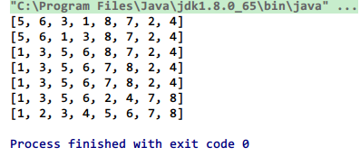

## 堆排序

> 堆排序是指利用堆这种数据结构所设计的一种排序算法。
>
> 堆是一个近似完全二叉树的结构（通常堆是通过一维数组来实现的），并同时满足堆的性质：即子结点的键值总是小于（或者大于）它的父节点。

### 堆

  我们这里提到的堆一般都指的是二叉堆，它满足二个特性：

- 父结点的键值总是大于或等于（小于或等于）任何一个子节点的键值。
- 每个结点的左子树和右子树都是一个二叉堆（都是最大堆或最小堆）。

如下是一个最小堆：

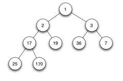

### 堆调整

 这是为了保持堆的特性而做的一个操作。对某一个节点为根的子树做堆调整，其实就是将该根节点进行 “下沉” 操作 (具体是通过和子节点交换完成的)，一直下沉到合适的位置，使得刚才的子树满足堆的性质。

我们以最大堆的调整为例：

1. 在对应的数组元素 A[i], 左孩子 A[LEFT(i)], 和右孩子 A[RIGHT(i)] 中找到最小的那一个，将其下标存储在 largest 中。
2. 如果 A[i] 已经就是最大的元素，则程序直接结束。
3. 否则，i 的某个子结点为最大的元素，将 A[largest] 与 A[i] 交换。
4. 再从交换的子节点开始，重复 1,2,3 步，直至叶子节点，算完成一次堆调整。

最小堆调整与之类似。

### 建堆

建堆是一个通过不断的堆调整，使得整个二叉树中的数满足堆性质的操作。

```java
public static void MakeMaxHeap(int a[], int n){
 for(int i=(n-1)/2 ; i>=0 ; i--){
     MaxHeapAdjust(a,i,n);
 }
}
```

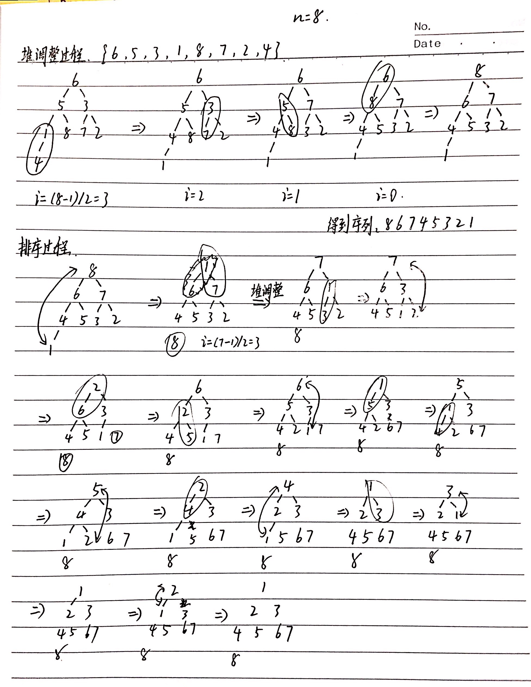

### 性能

| 一般情况     | 最优情况     | 最差情况     | 辅助空间 | 稳定性  |
| -------- | -------- | -------- | ---- | ---- |
| O(nlogn) | O(nlogn) | O(nlogn) | O(n) | 不稳定  |

### Java 实现

#### 代码

```java
/**
     * 堆调整
     */
    private void heapify(int arr[], int i, int n)            // 堆调整函数(这里使用的是最大堆)
    {
        int leftchild = 2 * i + 1;          // 左孩子索引
        int rightchild = 2 * i + 2;         // 右孩子索引
        int largest;                        // 选出当前结点与左右孩子之中的最大值
        if (leftchild < n && arr[leftchild] > arr[i])
            largest = leftchild;
        else
            largest = i;
        if (rightchild < n && arr[rightchild] > arr[largest])
            largest = rightchild;
        if (largest != i)
        {
            swap(arr, i, largest);        // 把当前结点和它的最大(直接)子节点进行交换
            heapify(arr, largest, n);            // 递归调用，继续从当前结点向下进行堆调整
        }
    }

    private void buildheap(int arr[], int n)          // 建堆函数
    {
        for (int i = n / 2 - 1; i >= 0; i--) // 对每一个非叶结点
            heapify(arr, i, n);                  // 不断的堆调整
    }

    void HeapSort(int[] arr, int n) {
        int index = 1;
        System.out.println("原始序列为：" + Arrays.toString(arr));
        buildheap(arr, n);
        System.out.println("大顶堆序列为：" + Arrays.toString(arr));
        for (int i = n - 1; i >= 1; i--) {
            swap(arr, 0, i); // 将堆顶元素(当前最大值)与堆的最后一个元素互换(该操作很有可能把后面元素的稳定性打乱,所以堆排序是不稳定的排序算法)
            n--;                     // 从堆中去掉最后一个元素
            heapify(arr, 0, n);                  // 从新的堆顶元素开始进行堆调整
            System.out.println("第" + index + " 趟排序后序列为：" + Arrays.toString(arr));
            index++;
        }
    }
```

#### 结果

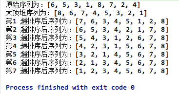