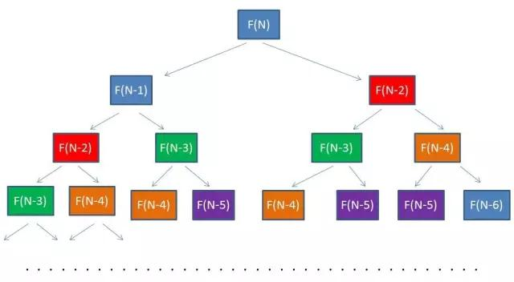

> 几个月前准备动手写一篇《深度解析动态规划》，写了半天，还是觉得没弄懂，遂作罢。
>
> 可是近来刷题却总是遇见动态规划的题目，所以必须得弄懂，深度解析不了，那就退而求其次，浅析一下吧。

<!-- more -->

## 何为动态规划？

知乎上有这样一个问题：[什么是动态规划？动态规划的意义是什么？](https://www.zhihu.com/question/23995189)

几位 acm 大神都给出了详细的解。大致总结起来就是：动态规划是通过**拆分问题，**定义问题状态和状态之间的关系，使得问题能够以递推（或者说分治）的方式去解决。

这段话字面意思很好理解，拆分和递推嘛。只要学会将一个问题拆分成几个子问题，然后根据几个子问题的解，推出该问题的解。这就是动态规划。

## 跳台阶问题

以经典递归入门题：[跳台阶](http://www.lintcode.com/zh-cn/problem/climbing-stairs/)为例。

> 假设你正在爬楼梯，需要n步你才能到达顶部。但每次你只能爬一步或者两步，你能有多少种不同的方法爬到楼顶部？

有编程常识的人，第一反应肯定是Fibonacci 数列。因为上n级台阶，最后一步可能上一步，也可能上两步，所以上n级台阶的方法数f(n) = f(n-1) + f(n-2)。

而 f(1) = 1, f(2) = 2，很明显是Fibonacci 数列，递归算法的教科书例子。

```java
F(1) = 1;
F(2) = 2; 
F(n) = F(n-1)+F(n-2)（n>=3）
```

所以我们很快就可以写出以下递归代码：

```java
public int climbStairs(int n) {
        // write your code here
        if (n == 1 || n == 0) {
            return 1;
        }
        if (n == 2) {
            return 2;
        }
        
  		return climbStairs(n-1) + climbstairs(n-2);
    }
```

上面的代码的结果无疑是正确的，但在LintCode上是无法通过的，因为递归时间复杂度太高，超时了。

## 备忘录算法

上面递归的算法，很容易得到优化的算法，因为递归的过程中，我们重复的进行了大量的运算。



如图标识的都是重复计算的节点，很明显我们可以通过缓存的方式，将已经计算的结果保存在起来，避免重复计算。

这就是备忘录算法。

```java
public int climbStairs(int n, HashMap<Integer, Integer> map) {
        // write your code here
        if (n == 1 || n == 0) {
            return 1;
        }
        if (n == 2) {
            return 2;
        }
        
  		if (map.contains(n)) {
          return map.get(n);
  		} else {
          int value = climbStairs(n-1) + climbstairs(n-2);
          map.put(n, value);
          return value;
  		}
    }
```

## 进一步优化

备忘录算法的空间复杂度和时间复杂度都为 O(N)。

而实际上，我们根据递推关系可以知道，并不需要将所有f(n)全记录下来。f(n)只依赖于f(n-1)和f(n-2)，因此我们只需要两个变量来记录f(n-1)和f(n-2)就可以了。

于是，算法可以进一步简化为：

```java
public int climbStairs(int n) {
        // write your code here
        if (n == 1 || n == 0) {
            return 1;
        }
        if (n == 2) {
            return 2;
        }
        
        int first = 1;
        int second = 2;
        int third = 0;
        
        for (int i = 3; i <= n; i++) {
            third = first + second;
            first = second;
            second = third;
        }
        
        return third;
    }
```

first 表示 f(n-2) 的结果，second 表示 f(n-1) 的结果，third 表示 f(n) 的结果。

到这里，我们总算写出了这个简单问题的动态规划算法。利用简洁的自底向上的递推方式，实现空间和时间上的最优化。

## 三要素

好的，现在让我们来分析一下，动态规划的三要素。

- 最优子结构
- 边界
- 状态转移公式

跳台阶的问题是要求解跳上 n 级台阶有多少种方式 F(N)，而这个问题可以分解为求跳上 n-1 级台阶的方法数和 n-2 级台阶的方法数之和。F(N-1) 和 F(n-2)就是该问题的最优子结构。

而当 n=1 和 n=2时，我们可以直接得出结果，F(1) 和 F(2) 就是问题的边界。如果一个问题没有边界，就没办法得到有限的结果。

F(N) = F(N-1) + F(N-2) 则是状态转移方程，是动态规划算法的核心，它决定了问题每一个阶段和下一个阶段的关系。

求解动态规划问题的核心，就在于寻找出三要素。

## 解题步骤

虽然这部分似乎有应试之嫌，我觉得还是有必要写一下，找工作对付笔试嘛==

动态规划的解题步骤就是确定三要素的过程。

1. 首先我们要确定问题的维数。通常来说，有几个对象就是几维的，例如上面跳台阶的问题明显是一维的，而最长公共序列之类的问题，涉及到两个序列的，通常是二维的。
2. 根据题目维数，生成一个相应维数的数组。
3. 根据边界条件，初始化数组边界。
4. 分析最优子结构和状态转移方程。
5. 根据状态转移方程和数组边界，递推出整个 dp 数组的内容。
6. 得到问题的解。

## 背包问题

似乎上面解题过程略抽象，所以我这里用经典的[背包问题](http://www.lintcode.com/zh-cn/problem/backpack/)为范例。

> 给出n个物品的体积A[i]和其价值V[i]，将他们装入一个大小为m的背包，最多能装入的总价值有多大？
>
> 例如，有编号分别为a,b,c,d,e的五件物品，它们的重量分别是2,2,6,5,4，它们的价值分别是6,3,5,4,6，现在给你个承重为10的背包，如何让背包里装入的物品具有最大的价值总和？

分析这个问题，过程如下：

首先，很明显这是个二维问题，体积和价值。

二维问题，需要初始化两个维度的边界。边界条件很明显，如果背包空间为 0 ，最大装入价值为 0；如果物品为 0 ，最大装入价值为 0。通常边界条件可以通过优化去除一些冗余的部分。

然后，我们来分析其最优子结构。该问题的目标是求解能装入的最大总价值，例如对物品 e 的处理有两种选择，如果空间足够装入物品e，装入或者不装。

如果装入，最优子结构为背包大小为 6, 物品 a,b,c,d 能装入背包的最大价值 + e.value。

如果不装，最优子结构为背包大小为 10, 物品 a,b,c,d 能装入背包的最大价值。

所以得到以下状态转移公式：

```java
F[i][j] = MAX(F[i-1][j], F[i-1][j-A[i]]+V[i]) (j >= A[i])
  
其中F[i-1][j]表示前i-1件物品中选取若干件物品放入剩余空间为j的背包中所能得到的最大价值；

而F[i-1][j-A[i]]+V[i]表示前i-1件物品中选取若干件物品放入剩余空间为 j-A[i] 的背包中所能取得的最大价值加上第i件物品的价值。
```

根据上面的分析，很容易写出以下的代码：

```java
public int backPackII(int m, int[] A, int V[]) {
        // write your code here
        if (A == null || 0 == A.length || m == 0 || V == null || 0 == V.length)  
               return 0;  
               
          int len = A.length;  
          int[][]  sum = new int[len][m + 1];  
          
  		// 初始化 dp 数组
  		// 空间为 0
          for(int i = 0; i < len; i++){  
               sum[i][0] = 0;  
          }  
          for(int j = 0; j < m + 1; j++){  
               if(j >= A[0]){  
                    sum[0][j] = V[0];  
               }  
          }
          // 从底向上的利用状态转移方程进行递推
          for(int i = 1; i < len; i++){  
               for(int j = 1; j < m + 1; j++){  
                    if(j >= A[i]){  
                         sum[i][j] = Math.max(sum[i-1][j], sum[i-1][j-A[i]] + V[i]);  
                    }else{  
                         sum[i][j] = sum[i-1][j];  
                    }  
               }  
          }
          
          return sum[len-1][m];
    }
```

DP 矩阵如下：

|      |  0   |  1   |  2   |  3   |  4   |  5   |  6   |  7   |  8   |  9   |  10  |
| :--: | :--: | :--: | :--: | :--: | :--: | :--: | :--: | :--: | :--: | :--: | :--: |
|  1   |  0   |  0   |  6   |  6   |  6   |  6   |  6   |  6   |  6   |  6   |  6   |
|  2   |  0   |  0   |  6   |  6   |  9   |  9   |  9   |  9   |  9   |  9   |  9   |
|  3   |  0   |  0   |  6   |  6   |  9   |  9   |  9   |  9   |  11  |  11  |  14  |
|  4   |  0   |  0   |  6   |  6   |  9   |  9   |  9   |  10  |  11  |  13  |  14  |
|  5   |  0   |  0   |  6   |  6   |  9   |  9   |  12  |  12  |  15  |  15  |  15  |

容易得到，最大装入价值为15。

其他动态规划问题，做类似分析，同样可求解。