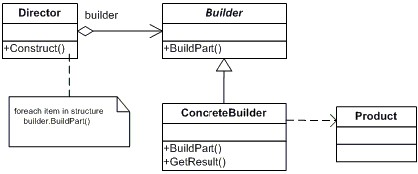
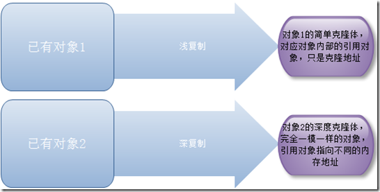
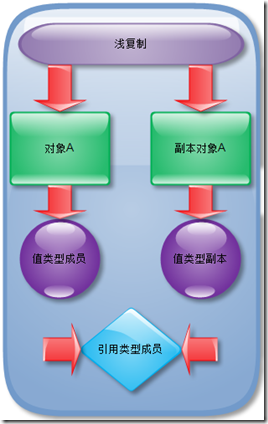
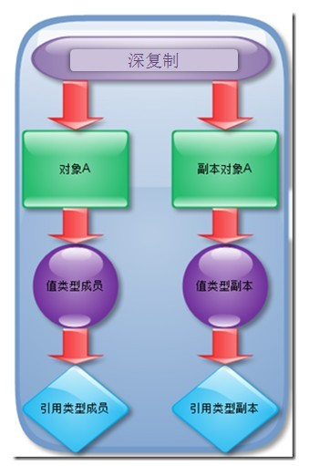

> 每天还是得写点东西，不要让自己松懈下来。哒哒哒！

今天讲什么呢？补一下设计模式的部分吧，今天说说创建型模式剩下的两种：建造者模式&原型模式。

<!-- more -->

## 建造者模式

先看定义

> Separate the construction of a complex objext from its representaion so that the same construction process can create different representations.
>
> 将一个复杂对象的构建与它的表示分离，使得同样的构建过程可以创建不同的表示。

怎么理解呢？举个简单的例子。现在大家都离不开手机对吧，手机行业发展到目前的程度，所有手机的装配过程应该都差不多，那为什么不同品牌的手机差别很大呢，因为配置不同。

同样的装配过程，生产出了不同的手机，这就是典型的建造者模式。

### 角色

建造者模式通常包括下面几个角色：

- builder：给出一个抽象接口，以规范产品对象的各个组成成分的建造。这个接口规定要实现复杂对象的哪些部分的创建，并不涉及具体的对象部件的创建。
- ConcreteBuilder：实现 Builder 接口，针对不同的商业逻辑，具体化复杂对象的各部分的创建。 在建造过程完成后，提供产品的实例。
- Director：调用具体建造者来创建复杂对象的各个部分，在指导者中不涉及具体产品的信息，只负责保证对象各部分完整创建或按某种顺序创建。
- Product：要创建的复杂对象。

结构图



### 实例

我们以手机生产为例

```java
// 手机抽象类
public abstract class CellPhone {
  private String cpu;   // cpu
    private String ram;   // 内存
    private String screen;// 屏幕
    private String battery; // 电池
    private String others; // 其他
  ... 省略get/set方法
}

// Mate9产品类
public class Mate9 extends CellPhone {
    public Mate9() {
        System.out.println("这是华为Mate9");
    }

    @Override
    public String toString() {
        return "具体配置： CPU： " + this.getCpu() + "\n 内存： " + this.getRam()
                + "\n 屏幕大小： " + this.getScreen() + "\n 电池容量： " + this.getBattery()
                + "\n 其他： " + this.getOthers();
    }
}

//MX6产品类
public class Mx6Pro extends CellPhone {
    public Mx6Pro() {
        System.out.println("这是魅族Pro6");
    }

    @Override
    public String toString() {
        return "具体配置： CPU： " + this.getCpu() + "\n 内存： " + this.getRam()
                + "\n 屏幕大小： " + this.getScreen() + "\n 电池容量： " + this.getBattery()
                + "\n 其他： " + this.getOthers();
    }
}

// 手机建造者 抽象
public interface CellPhoneBuilder {
    public void buildCPU();
    public void buildRam();
    public void buildScreen();
    public void buildBattery();
    public void buildOthers();
    public CellPhone getPhone();
}

// Mate9建造者 具体
public class Mate9Build implements CellPhoneBuilder {
    CellPhone mate9 = new Mate9();

    @Override
    public void buildCPU() {
        mate9.setCpu("麒麟935");
    }

    @Override
    public void buildRam() {
        mate9.setRam("使用3G内存");
    }

    @Override
    public void buildScreen() {
        mate9.setScreen("6英寸IPS屏幕");
    }

    @Override
    public void buildBattery() {
        mate9.setBattery("4100毫安超大电池");
    }

    @Override
    public void buildOthers() {
        mate9.setOthers("采用后背指纹按压技术");
    }

    @Override
    public CellPhone getPhone() {
        return mate9;
    }
}

// MX6建造者 具体
public class Mx6ProBuild implements CellPhoneBuilder {
    CellPhone mx6Pro = new Mx6Pro();

    @Override
    public void buildCPU() {
        mx6Pro.setCpu("三星9660");
    }

    @Override
    public void buildRam() {
        mx6Pro.setRam("4G内存");
    }

    @Override
    public void buildScreen() {
        mx6Pro.setScreen("5.5寸superAmoled屏幕");
    }

    @Override
    public void buildBattery() {
        mx6Pro.setBattery("3300毫安大电池");
    }

    @Override
    public void buildOthers() {
        mx6Pro.setOthers("前置指纹按压识别");
    }

    @Override
    public CellPhone getPhone() {
        return mx6Pro;
    }
}

// 手机建造指导者
public class CellPhoneDirector {
    private CellPhoneBuilder cellPhoneBuilder;

    public Mate9 buildMate9() {
        cellPhoneBuilder = new Mate9Build();
        cellPhoneBuilder.buildCPU();
        cellPhoneBuilder.buildRam();
        cellPhoneBuilder.buildScreen();
        cellPhoneBuilder.buildBattery();
        cellPhoneBuilder.buildOthers();
        return (Mate9)cellPhoneBuilder.getPhone();
    }

    public Mx6Pro buildMx6Pro() {
        cellPhoneBuilder = new Mx6ProBuild();
        cellPhoneBuilder.buildCPU();
        cellPhoneBuilder.buildRam();
        cellPhoneBuilder.buildScreen();
        cellPhoneBuilder.buildBattery();
        cellPhoneBuilder.buildOthers();
        return (Mx6Pro)cellPhoneBuilder.getPhone();
    }
}

// 测试
public class CellPhoneTest {
    public static void main(String[] args) {
        CellPhoneDirector director = new CellPhoneDirector();
        // 华为手机定制生产
        System.out.println("开始制造华为手机：");
        Mate9 mate9 = director.buildMate9();
        System.out.println(mate9);
        // 魅族手机定制生产
        System.out.println("开始制造魅族手机： ");
        Mx6Pro mx6Pro = director.buildMx6Pro();
        System.out.println(mx6Pro);
    }
}
```

```java
// 结果
开始制造华为手机：
这是华为Mate9
具体配置： CPU： 麒麟935
 内存： 使用3G内存
 屏幕大小： 6英寸IPS屏幕
 电池容量： 4100毫安超大电池
 其他： 采用后背指纹按压技术
开始制造魅族手机： 
这是魅族Pro6
具体配置： CPU： 三星9660
 内存： 4G内存
 屏幕大小： 5.5寸superAmoled屏幕
 电池容量： 3300毫安大电池
 其他： 前置指纹按压识别
```

建造者模式和工厂模式非常相似，建造者模式注重零部件的组装过程，而工厂方法模式更注重零部件的创建过程。两者也有结合使用：比如众神造人，女娲利用建造者模式负责把灵魂、耳目、手臂等组合成一个完整的人，而皇帝、桑林等人各自利用工厂方法模式创造出灵魂，耳目，手臂等。女娲不必考虑灵魂、耳目、手臂是什么样子的，怎么创造出来的，这就成为了一个由建造者模式和工厂方法模式组合而成的系统。


### 优点

- 封装性，使用建造者模式可以使客户端不必知道产品的内部组成的细节
- 建造者独立，易于扩展
- 便于控制细节风险，由于具体建造者是独立的，因此可以对建造者过程逐步细化，而不对其他模块产生影响

### 使用场景

- 当采用相同的方法，不同的执行顺序会产生不同的结果时
- 多个部件或零件都可以装配到一个对象中，但产生的运行结果又不相同时
- 当产品类非常复杂，或者产品类中的方法调用顺序不同产生不同的效能时
- 创建一些复杂的对象时，这些对象的内部组成构件间的建造顺序是稳定的，但是对象的内部组成构件面临着复杂的变化。
- 要创建的复杂对象的算法，独立于该对象的组成部分，也独立于组成部分的装配方法时。


## 原型模式

照例先看定义

> Specify the kinds of objects to create using a prototypical instance, and create new objects by copying this prototype.
>
> 用原型对象指定创建对象的种类，并且通过复制这些原型创建新的对象。

微信的群功能大家肯定都用过，尤其是逢年过节的时候群发祝福短信，最忌讳别人发现是群发的，显得没有诚意。因此微信群发有个贴心的功能，就是根据备注，在消息前面添加上每个人的姓名，这样就显得诚意满满了。

这里就很类似于原型模式了，以祝福短信为原型创建了N条祝福短信发给N个好友。


### 角色

- 客户（Client）角色：使用原型对象的客户程序

- 抽象原型（Prototype）角色：规定了具体原型对象必须实现的接口

- 具体原型（ConcretePrototype）：从抽象原型派生而来，是客户程序使用的对象，即被复制的对象。此角色需要实现抽象原型角色所要求的接口。

  ​


Java 内置了克隆机制。Object 类具有一个 clone() 方法，能够实现对象的克隆，使一个类支持克隆只需两步：

- 实现 Cloneable 接口
- 覆盖 Object 的 clone() 方法

因此，在 Java 中实现原型模式非常简单。

### 实例

以群发邮件为例

```java
// 邮件原型
public class Mail implements Cloneable {
    private String receicer;  // 收件人
    private String subject;   // 邮件标题
    private String appellation; // 称谓
    private String context;     // 邮件内容
    private String tail;       //  邮件尾部

    // 构造函数
    public Mail (String subject, String context) {
        this.subject = subject;
        this.context = context;
    }

    // 克隆方法
    public Mail clone() {
        Mail mail = null;
        try {
            mail = (Mail)super.clone();
        } catch (CloneNotSupportedException e) {
            e.printStackTrace();
        }
        return mail;
    }
  ...// 省略get/set方法
}

// 测试类
public class SendMailDemo {
    Map students = new LinkedHashMap();
    public static void main(String[] args) {
        Mail mail = new Mail("参加座谈会", "2017年4月6号，233教室开会，所有人必须到场，不得迟到。");
        mail.setTail("请各位同学相互通知");
        SendMailDemo sendMailDemo = new SendMailDemo();
        Map student = sendMailDemo.getStudents();
        for (Object name:student.keySet()) {
            Mail cloneMail = mail.clone();
            cloneMail.setAppellation(name.toString());
            cloneMail.setReceicer(student.get(name).toString());
            sendMailDemo.sendMail(cloneMail);
        }
    }

    private void sendMail(Mail mail) {
        System.out.println("标题： " + mail.getSubject() + "\t 收件人： " + mail.getReceicer()
        + "\n 正文： " + mail.getContext() + "... ... 已发送！");
    }

    public Map getStudents() {
        students.put("李一", "liyi@gmail.com");
        students.put("王二", "wanger@gmail.com");
        students.put("张三", "zhangsan@gmail.com");
        students.put("李四", "lisi@gmail.com");
        students.put("赵武", "zhaowu@gmail.com");
        return students;
    }
}
```

```java
// 结果
标题： 参加座谈会	 收件人： liyi@gmail.com
 正文： 2017年4月6号，233教室开会，所有人必须到场，不得迟到。... ... 已发送！
标题： 参加座谈会	 收件人： wanger@gmail.com
 正文： 2017年4月6号，233教室开会，所有人必须到场，不得迟到。... ... 已发送！
标题： 参加座谈会	 收件人： zhangsan@gmail.com
 正文： 2017年4月6号，233教室开会，所有人必须到场，不得迟到。... ... 已发送！
标题： 参加座谈会	 收件人： lisi@gmail.com
 正文： 2017年4月6号，233教室开会，所有人必须到场，不得迟到。... ... 已发送！
标题： 参加座谈会	 收件人： zhaowu@gmail.com
 正文： 2017年4月6号，233教室开会，所有人必须到场，不得迟到。... ... 已发送！
```


### 优点

- 性能优良：原型模式是对内存中二进制流的拷贝，要比直接new一个对象性能好，特别是当一个循环体中产生大量对象是，原型模式可以更好的体现其优点。
- 逃避构造函数的约束。


### 使用场景

- 资源优化场景，类初始化时需要消耗非常多的资源。
- 性能和安全性要求的场景，如果通过new产生一个对象需要非常繁琐的数据准备和访问权限，则可以考虑使用原型模式。
- 一个对象多个修改者的场景，一个对象需要提供给其他对象访问，而且各个调用者可能都需要修改其值时，可以考虑使用原型模式拷贝多个对象供调用者使用。

在实际项目中，原型模式很少单独出现，一般是和工厂方法模式一起出现。原型模式通过clone()创建一个对象，然后由工厂方法提供给调用者。


### 深拷贝&浅拷贝

#### 原型模式的原理图：



#### 浅拷贝

被拷贝对象的所有变量都含有与原对象相同的值，而且对其他对象的引用仍然是指向原来的对象。即浅拷贝只负责当前对象实例，对引用的对象不做拷贝。
浅复制后的对象和对象副本的情况：



#### 深拷贝

被拷贝对象的所有的变量都含有与原来对象相同的值，除了那些引用其他对象的变量。那些引用其他对象的变量将指向一个被拷贝的新对象，而不再是原有那些被引用对象。即 深拷贝把要拷贝的对象所引用的对象也都拷贝了一次，而这种对被引用到的对象拷贝叫做间接拷贝。
深复制的对象和对象副本的情况：



深拷贝要深入到多少层，是一个不确定的问题。
在决定以深拷贝的方式拷贝一个对象的时候，必须决定对间接拷贝的对象是采取浅拷贝还是深拷贝还是继续采用深拷贝。
因此，在采取深拷贝时，需要决定多深才算深。此外，在深拷贝的过程中，很可能会出现循环引用的问题。

### 注意事项

- 使用原型模式复制对象不会调用类的构造方法。因为对象的复制是通过调用 Object 类的 clone 方法来完成的，它直接在内存中复制数据，因此不会调用到类的构造方法。不但构造方法中的代码不会执行，甚至连访问权限都对原型模式无效。还记得单例模式吗？单例模式中，只要将构造方法的访问权限设置为 private 型，就可以实现单例。但是 clone 方法直接无视构造方法的权限，所以，单例模式与原型模式是冲突的，在使用时要特别注意。

- 深拷贝与浅拷贝。Object 类的 clone 方法只会拷贝对象中的基本的数据类型，对于数组、容器对象、引用对象等都不会拷贝，这就是浅拷贝。如果要实现深拷贝，必须将原型模式中的数组、容器对象、引用对象等另行拷贝。例如：

  ```java
  public class Prototype implements Cloneable {  
      private ArrayList list = new ArrayList();  
      public Prototype clone(){  
          Prototype prototype = null;  
          try{  
              prototype = (Prototype)super.clone();  
              prototype.list = (ArrayList) this.list.clone();  
          }catch(CloneNotSupportedException e){  
              e.printStackTrace();  
          }  
          return prototype;   
      }  
  }  
  ```

​        由于 ArrayList 不是基本类型，所以成员变量 list，不会被拷贝，需要我们自己实现深拷贝，幸运的是 Java 提供的大部分的容器类都实现了 Cloneable 接口。所以实现深拷贝并不是特别困难。

**PS：深拷贝与浅拷贝问题中，会发生深拷贝的有 java 中的 8 中基本类型以及他们的封装类型，另外还有 String 类型。其余的都是浅拷贝。**


ok，至此创建者模式全部说完，后面会讲一下几种重点设计模式，不会再一个个聊了。