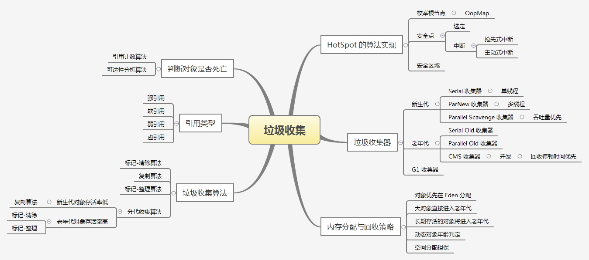
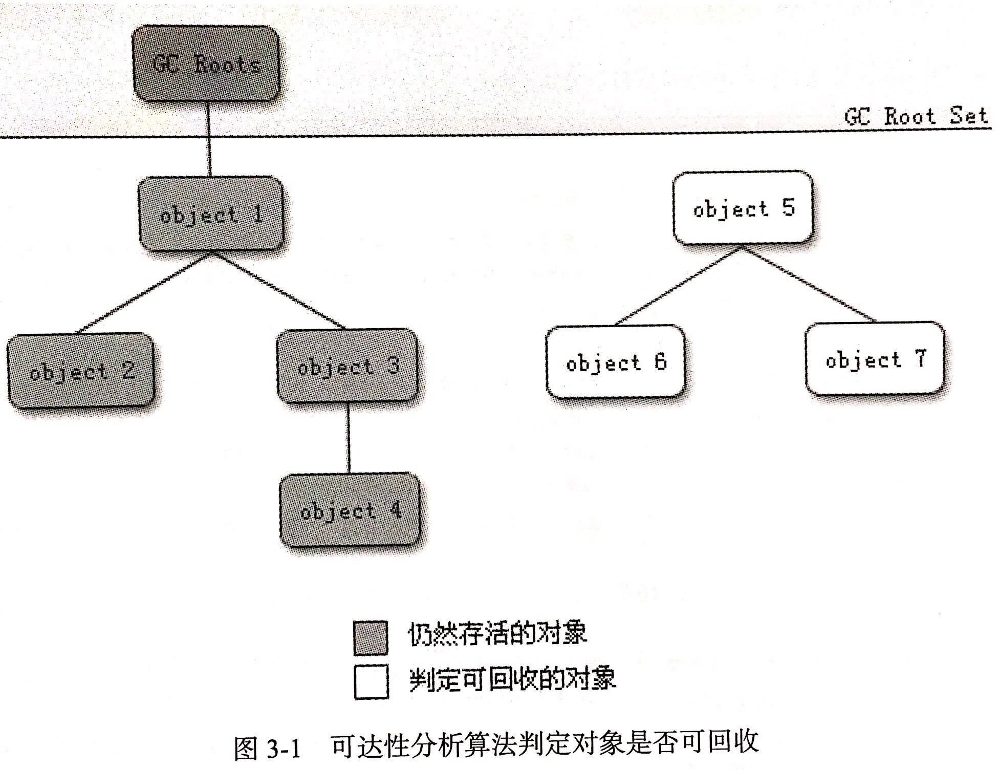
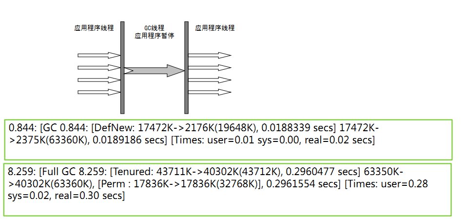
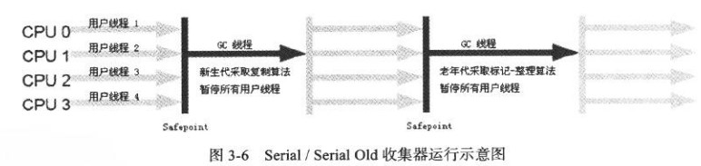
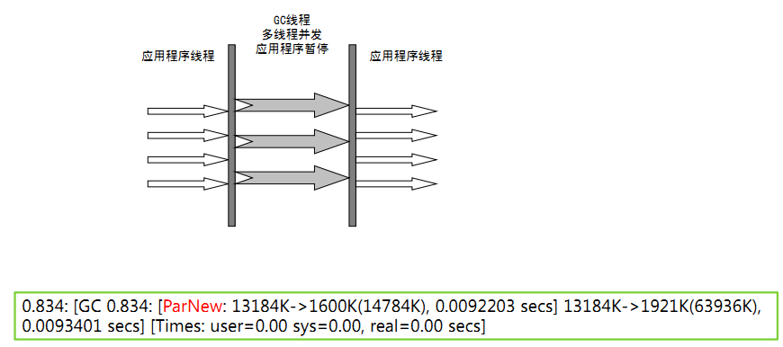
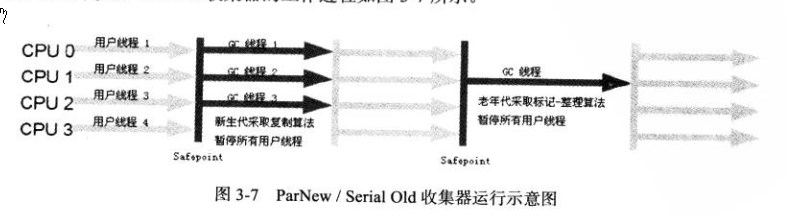
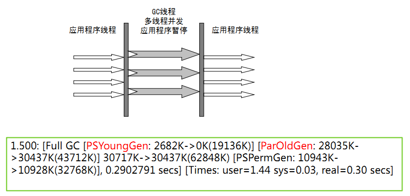
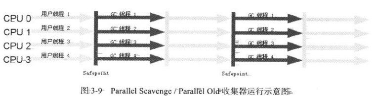

> Java 与 C++ 之间有一堵由内存动态分配与垃圾收集技术所谓成的高墙，墙外面的人想进去，墙里面的人却想出来。——《深入理解 Java 虚拟机》

前几天的问题没想出个结果，所以还是好好打基础，刷算法题看书。做好当下，其他的问题想不去管它，想得太多做的太少乃是大忌。

今天写写 GC，总结一下。本文主要内容来自于《深入理解 Java 虚拟机》一书，附加一些心得。希望有一天我也能写本这样的好书。

<!-- more -->

## GC 概述

GC 几乎是 Java 程序员面试必考的问题，因为虽然当前的内存动态分配与回收技术已经相当成熟，可是作为一个优秀的程序员，知其然知其所以然，才是进阶之道。

首先我们回忆一下，Java 内存运行时有哪些区域？

程序计数器，虚拟机栈，本地方法栈，堆以及方法区。

其中，程序计数器，虚拟机栈和本地方法栈是线程私有的，生命周期与线程生命周期保持一致。栈中的栈帧随着方法的进出而有条不紊地执行着入栈和出栈的操作，每一个栈帧中分配多少内存基本上在类结构确定下来时就是已知的。

> 这部分可以参见字节码部分的内容，使用 javap 命令工具可以将字节码翻译为易读的文件格式。

因此，这几个区域的内存分配和回收都具有确定性。

但 Java 堆和方法区不一样，一个接口中的多个实现类需要的内存可能不一样，一个方法中的多个分支需要的内存也可能不一样，我们只有在程序运行期间才能知道会创建哪些对象，这部分内存的分配和回收都是动态的。

垃圾收集器关注的就是此部分的内存。

## 对象的存活状态

垃圾收集器所做的工作就是将堆内不会再被使用的内存进行回收，所以首先要做的事，是判断对象的存活状态，哪些对象还活着，哪些对象已经死了。

### 引用计数法

最经典的方法就是引用计数法，它的算法实现是这样的。

给对象中添加一个引用计数器，每当一个地方引用它时，计数器值就加一；当引用失效时，计数器值就减一；任何时候计数器值为0的对象即为不可能再被使用的。

> 引用计数器法实现起来很简单，效率也高，但存在一个很大的问题。

**引用计数法很难解决对象之间相互循环引用的问题。**

当两个对象都不能再被访问，但是由于它们之间相互引用，导致二者的引用计数均不为0，也就无法被回收。

### 可达性分析算法

主流的商用程序语言都是利用可达性分析来判定对象是否存活的。

算法的基本思想：通过一系列称为“GC Roots”的对象作为起始点，从这些节点开始向下搜索，搜索走过的路径称为引用链，当一个对象到 GC Roots 没有任何引用链相连，即不可达时，则证明此对象不可用。

例如上图，object5、6、7之间虽有相互关联，但因为它们到GC Roots 是不可达的，所以仍会被判定为可回收对象。

> 可以作为 GC Roots 的对象包括以下几种：
>
> - 虚拟机栈（栈帧中的本地变量表）中引用的对象
> - 方法区中类静态属性引用的对象
> - 方法区中常量引用的对象
> - 本地方法栈中JNI引用的对象

[如何输出 GC 日志？](http://ifeve.com/useful-jvm-flags-part-8-gc-logging/)

> -XX:PrintGC                                 简单GC日志模式
>
> -XX:PrintGCDetails                     详细GC日志模式
>
> -XX:+PrintGCTimeStamp           相对时间模式
>
> -XX:+PrintGCDateStamps          绝对时间模式

### 引用分类

JDK1.2 之后，Java 对引用的概念进行了扩充，将引用分为强引用、软引用、弱引用、虚引用四种，引用强度依次减弱。

- 强引用，就是程序代码中普遍存在的引用，只要强引用存在，垃圾收集器永远不会回收掉被引用的对象。
- 软引用，用来描述一些还有用但并非必需的对象。对于软引用关联着的对象，再系统将要发生内存溢出异常之前，将会把这些对象列入回收范围进行第二次回收，如果回收内存仍不足，才会抛出内存溢出异常。也就是说，内存足够的情况下，将不会对只被软引用关联的对象进行回收。
- 弱引用，用来描述非必需对象。被弱引用关联的对象只能生存到下一次垃圾收集发生之前。也就是说，垃圾收集器工作时，一定会回收掉只被弱引用关联的对象。
- 虚引用，最弱的引用。为一个对象设置虚引用关联的唯一目的就是能在对象被垃圾收集器回收时收到一个系统通知，真是so sad！

### 生存还是死亡？

在可达性分析中不可达的对象，是不是非死不可呢？

并不是，它们只是被判缓刑了。要真正对一个对象执行死刑，至少需要进行两次标记过程：

1. 如果对象在可达性分析中判定为不可达，那么它会被第一次标记并且进行一次筛选。

   > 筛选的条件是此对象有没有必要执行 finalize() 方法。当对象没有覆盖 finalize() 方法，或者 finalize() 方法已经被虚拟机调用过，则视为没有必要执行。也就是说，这两种情况下，对象将被直接回收。

2. 如果该对象被判定有必要执行finalize() 方法，那么它将会被放置在一个叫做 F-Queue 的队列中，并在稍后由虚拟机自动建立的一个低优先级的 Finalizer 线程去执行它。这里的执行是指虚拟机会触发这个方法，但不保证等待它运行结束。

   finalize() 方法是对象逃脱死亡命运的最后一次机会，稍后 GC 将会对 F-Queue 中的对象进行第二次小规模的标记。

   如果对象在 finalize() 方法中成功拯救了自己（重新变为可达状态），则在第二次标记时，它将会被移除出“即将回收”的集合。

finalize() 方法运行代价高昂，不确定性大，无法保证各个对象的调用顺序。而且它所能做的工作，使用 try-finally 或者其他方式能做得更好，更及时，所以大家还是忘了有这个方法的存在吧！

### 回收方法区

永久代的垃圾收集主要是两部分内容：废弃常量和无用的类。

## GC 算法

### 标记-清除算法

最基础的收集算法，首先标记出所有需要回收的对象，在标记完成后统一回收所有被标记的对象，其标记过程如前文所述。

该算法主要有两个不足：

- 其一，效率问题，标记和清楚两个过程效率都不高；
- 其二，空间问题，标记清除后会产生大量不连续的内存碎片，空间碎片太多会导致后续程序运行过程中需要分配较大对象时，无法找到足够的连续内存而不得不提前触发另一次 GC。频繁的 GC 会极大的影响系统的性能。

### 复制算法

为了解决标记-清除算法的不足，复制算法应运而生。

该算法的主要思路就是将内存分为相等的两块，每次使用其中一块，当这一块内存用完了，就将还存活着的对象复制到另一块上，然后把这一块已使用的内存空间一次清理掉。

很明显，该算法解决了内存碎片的问题，但也存在着另一个问题，每次只能使用一半内存。一个8G的内存条，每次只能使用其中的4G，难不难受？

但如果每次存活下来的对象只占极少数，就不用按1:1来划分内存空间了。

我们将内存划分为一块较大的 Eden 空间和两块较小的 Survivor 空间，每次使用 Eden 和其中一块 Survivor。当回收时，将 Eden 和 Survivor 中还存活的对象，一次性复制到另一块 Survivor 空间上，最后清理掉 Eden 和 刚才用过的 Survivor 空间。

如果存活的对象太大，Survivor 空间放不下，则通过内存分配担保将这些对象放入老年代 Old Generation。

**现代的商用虚拟机都采用复制算法来回收新生代。**原因在于，新生代对象存活率较低，所以复制操作较少，效率不会太低。

### 标记-整理算法

而老年代中对象存活率较高，如果使用复制算法就要进行较多的复制操作，效率会很低。并且老年代没有额外的内存进行分配担保。

针对老年代的特点，有人提出了“标记-整理算法”。标记的过程仍然相同，但后续步骤不是直接对可回收对象进行清理，而是让所有存活的对象向一端移动，最后直接清理掉端边界以外的内存。

### 分代收集算法

按照对象的存活周期的不同，将内存划分为新生代和老年代。

依据不同年代的特点，采用最适当的收集算法，这就是分代收集算法。

新生代——复制算法

老年代——“标记-清理”或者“标记-整理”算法

## 垃圾收集器

HotSpot 虚拟机所有的垃圾收集器大致如图所示：

此部分部分图片来自网络，来源比较杂，就不一一标注了。

### 串行收集器

#### Serial 收集器

Seria l收集器是一个新生代收集器，单线程执行，使用复制算法。

“Stop the world”：它在进行垃圾收集时，必须暂停其他所有的工作线程(用户线程)。

Serial 收集器是 JVM client模式下默认的新生代收集器。对于限定单个CPU的环境来说，Serial收集器由于没有线程交互的开销，专心做垃圾收集自然可以获得最高的单线程收集效率。

> -XX:+UseSerialGC

#### Serial Old  收集器

Serial Old是Serial收集器的老年代版本，它同样使用一个单线程执行收集，使用“标记-整理”算法。主要使用在Client模式下的虚拟机。

> -XX:+UseSerialOldGC

### 并行收集器

#### ParNew 收集器

ParNew 收集器其实就是serial收集器的多线程版本，除了使用多条线程进行垃圾收集之外，其余行为与 Serial 收集器一样。

> -XX:+UseParNewGC
>
> -XX:ParallelGCThreads 限制线程数量

#### Parallel Scavenge 收集器

Parallel Scavenge 收集器也是一个新生代收集器，它也是使用复制算法的收集器，又是并行多线程收集器。parallel Scavenge 收集器的特点是它的关注点与其他收集器不同，CMS等收集器的关注点是尽可能地缩短垃圾收集时用户线程的停顿时间，而 parallel Scavenge 收集器的目标则是达到一个可控制的吞吐量。

吞吐量= 程序运行时间/(程序运行时间 + 垃圾收集时间)，虚拟机总共运行了100分钟。其中垃圾收集花掉1分钟，那吞吐量就是99%。

> -XX:+UseParallelGC

#### Parallel Old 收集器

Parallel Old是Parallel Scavenge收集器的老年代版本，使用多线程和“标记-整理”算法。

> -XX:+UseParallelOldGC

### CMS 收集器(并发)

CMS 收集器（Concurrent Mark Sweep：**并发标记清除**）是一种**以获取最短回收停顿时间为目标**的收集器。适合应用在互联网站或者B/S系统的服务器上，这类应用尤其重视服务器的响应速度，希望系统停顿时间最短。

> 这里我们需要注意，并发与并行的区别。
>
> 前面几种并行收集器，指的是多条垃圾收集线程可以并行工作，但垃圾收集线程工作的时候，用户线程是处于等待状态的。
>
> 其目的在于利用多线程缩短垃圾收集的时间。
>
> 而并发收集器，指的是用户线程和垃圾收集线程同时执行。真正实现了你妈一边在扫地，你还可以一边扔垃圾的操作，并且你还不会挨揍==。

CMS 收集器作为老年代收集器，无法与 Parallel Scavenge 收集器配合工作。JDK1.5中使用 CMS 来收集老年代时，新生代只能选择 ParNew 或者 Serial 收集器之一。

> -XX:+UseConcMarkSweepGC 新生代默认使用 ParNew 收集器

CMS收集器是基于“标记-清除”算法实现的，整个收集过程大致分为4个步骤：

1. 初始标记(CMS initial mark)
2. 并发标记(CMS concurrenr mark)
3. 重新标记(CMS remark)
4. 并发清除(CMS concurrent sweep)

但是不是所有阶段都同时进行，在初始标记、重新标记阶段还是需要Stop the World。

#### CMS 收集器特点

1. 尽可能降低停顿

2. 会影响系统整体吞吐量和性能

   比如，在用户线程运行过程中，分一半CPU去做GC，系统性能在GC阶段，反应速度就下降一半

3. 清理不彻底

   因为在清理阶段，用户线程还在运行，会产生新的垃圾，无法清理

4. 因为和用户线程一起运行，不能在空间快满时再清理，需要为用户线程的运行预留一部分内存空间。因此需要设定GC的启动阈值。JDK1.5 中默认启动阈值为68%，JDK1.6中为92%。

   > -XX:CMSInitiatingOccupancyFraction  设置触发GC的阈值
   >
   > ​
   >
   > 如果不幸内存预留空间不够，就会引起concurrent mode failure，此时虚拟机会临时启用 Serial Old 收集器来进行老年代的垃圾收集。

5. CMS 收集器采用“标记-清除”算法，因此收集过程中会产生大量内存碎片。

### G1 收集器

G1 (Garbage First) 收集器是 JDK1.7 提供的一个新收集器，G1 收集器基于“标记-整理”算法实现，也就是说不会产生内存碎片。

- 并行和并发
- 分代收集
- 空间整合
- 可预测的停顿

还有一个特点，之前的收集器进行收集的范围都是整个新生代或老年代，而 G1 将整个Java堆(包括新生代，老年代)。

这里有一篇博文：[深入理解G1垃圾收集器](http://ifeve.com/%E6%B7%B1%E5%85%A5%E7%90%86%E8%A7%A3g1%E5%9E%83%E5%9C%BE%E6%94%B6%E9%9B%86%E5%99%A8/)

### GC 参数整理

> -XX:+UseSerialGC：在新生代和老年代使用串行收集器
>
> -XX:SurvivorRatio：设置eden区大小和survivior区大小的比例
>
> -XX:NewRatio:新生代和老年代的比
>
> -XX:+UseParNewGC：在新生代使用并行收集器
>
> -XX:+UseParallelGC ：新生代使用并行回收收集器
>
> -XX:+UseParallelOldGC：老年代使用并行回收收集器
>
> -XX:ParallelGCThreads：设置用于垃圾回收的线程数
>
> -XX:+UseConcMarkSweepGC：新生代使用并行收集器，老年代使用CMS+串行收集器
>
> -XX:ParallelCMSThreads：设定CMS的线程数量
>
> -XX:CMSInitiatingOccupancyFraction：设置CMS收集器在老年代空间被使用多少后触发
>
> -XX:+UseCMSCompactAtFullCollection：设置CMS收集器在完成垃圾收集后是否要进行一次内存碎片的整理
>
> -XX:CMSFullGCsBeforeCompaction：设定进行多少次CMS垃圾回收后，进行一次内存压缩
>
> -XX:+CMSClassUnloadingEnabled：允许对类元数据进行回收
>
> -XX:CMSInitiatingPermOccupancyFraction：当永久区占用率达到这一百分比时，启动CMS回收
>
> -XX:UseCMSInitiatingOccupancyOnly：表示只在到达阀值的时候，才进行CMS回收